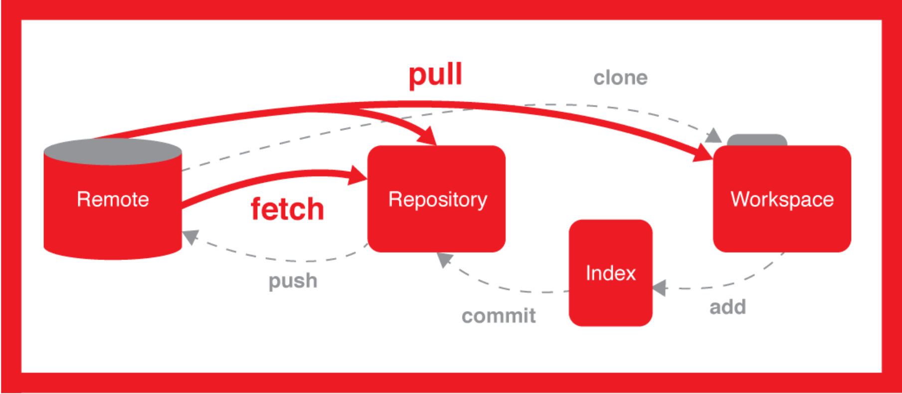

### 1.git初始化
+ 清空现有的key
```
rm -rf ~/.ssh/*
```
+ 运行
```
ssh-keygen -t rsa -b 4096 -C "你的邮箱"
```
+ 执行
```
cat ~/.ssh/id_rsa.pub
```
+ 把得到的公钥放到GitHub上
+ 执行
```
ssh -T git@github.com
```
+ 之后配置下git（这是全局配置，如果配置单个仓库，去掉global即可）
```
git config --global user.name 你的英文名   #此英文名不需要跟GitHub账号保持一致                                                
git config --global user.email 你的邮箱   #此邮箱不需要跟GitHub账号保持一致                                                   
git config --global push.default matching
git config --global core.quotepath false
git config --global core.editor "vim"

```
+ 增加 origin
```
 git remote add origin  https://github.com/Composur/vue-admin.git
```

### 2.git clone branch

```
git branch -r/-a 查看远程/所有分支
```
然后
```
git checkout -b 本地分支名x origin/远程分支名x
```
会在本地新建分支x，并自动切换到该本地分支x

### 3.git 放弃本地修改

```
git checkout . #本地所有修改的。没有的提交的，都返回到原来的状态
```

### 4.git 拉取远程分支到本地
+ 这里本地已经与origin master建立连接
+ 把远程分支拉到本地
```
git fetch origin dev（dev为远程仓库的分支名）
```
+ 在本地创建分支dev并切换到该分支
```
git checkout -b dev(本地分支名称) origin/dev(远程分支名称)
```
+ 把某个分支上的内容都拉取到本地
```
git pull origin dev(远程分支名称)
```
### 5.git 删除本地/远程分支

+ 删除本地
```
git branch -d BranchName
```
+ 删除远程
```
git push origin --delete BranchName
```

### 6.Git log
+ 默认不用任何参数的话，git log 会按提交时间列出所有的更新
+ git log -p -2 我们常用 -p 选项展开显示每次提交的内容差异，用 -2 则仅显示最近的两次更新：
+ Git 提供了 --word-diff 选项。我们可以将其添加到 git log -p 命令的后面，从而获取单词层面上的对比


### 7.修改分支名称

+ 当前分支修改

```
git branch -m new-name
```
+ 其它分支修改

```
git branch -m old-name new-name
```

+ 重命名本地和远程分支

```
git push origin :old-name new-name

git push origin -u new-name
```

### 8.合并分支
+ dev合并到master
```
git checkout master
git pull origin master
git merge dev
git push origin master

```
### 9.git 同步fork的repo
+ 查看远程

```
git remote -v
> origin  https://github.com/YOUR_USERNAME/YOUR_FORK.git (fetch)
> origin  https://github.com/YOUR_USERNAME/YOUR_FORK.git (push)
```
+ 增加远程fork的upstream

```
$ git remote add upstream https://github.com/ORIGINAL_OWNER/ORIGINAL_REPOSITORY.git
$ git remote -v
> origin    https://github.com/YOUR_USERNAME/YOUR_FORK.git (fetch)
> origin    https://github.com/YOUR_USERNAME/YOUR_FORK.git (push)
> upstream  https://github.com/ORIGINAL_OWNER/ORIGINAL_REPOSITORY.git (fetch)
> upstream  https://github.com/ORIGINAL_OWNER/ORIGINAL_REPOSITORY.git (push)

```
+ 更新

```
$ git fetch upstream branch_name
> remote: Counting objects: 75, done.
> remote: Compressing objects: 100% (53/53), done.
> remote: Total 62 (delta 27), reused 44 (delta 9)
> Unpacking objects: 100% (62/62), done.
> From https://github.com/ORIGINAL_OWNER/ORIGINAL_REPOSITORY
>  * [new branch]      master     -> upstream/master
```


```
$ git rebase upstream branch_name

# 上面两步合为一步

$ git pull upstream  branch_name --rebase
```


+ 提交到代码（remote origin）
  + 初次 push
  ```
  git push --set-upstream origin branch_name
  ```
  + 非初次 push 

  ```
  git push
  ```

```
$ git checkout master
> Switched to branc 'master'
```


+ 本地合并到upstream/master

```
$ git merge upstream/master
> Updating a422352..5fdff0f
> Fast-forward
>  README                    |    9 -------
>  README.md                 |    7 ++++++
>  2 files changed, 7 insertions(+), 9 deletions(-)
>  delete mode 100644 README
>  create mode 100644 README.md
```

+ 更新自己的repo

```
git push origin master
```


### 10.Reset版本回退利器
#### 如果我们想回退到某个版本可以用git log查看，git log命令显示从最近到最远的提交日志如果嫌输出信息太多，可以试试加上--pretty=oneline参数;

* reset命令把当前分支指向另一个位置，并且有选择的变动工作目录和索引。也用来在从历史仓库中复制文件到索引，而不动工作目录。

* 如果不给选项（默认--mixed ），那么当前分支指向到那个提交。如果用--hard选项，那么工作目录也更新，如果用--soft选项，那么都不变。

* 如果没有给出提交点的版本号，那么默认用HEAD。这样，分支指向不变，但是索引会回滚到最后一次提交，如果用--hard选项，工作目录也同样。

* 如果给了文件名(或者 -p选项), 那么工作效果和带文件名的checkout差不多，除了索引被更新。

```
git reset --hard HEAD^ #回退到上个版本有多少个^就回退多少个版本
git reset --hard HASH #返回到某个节点，不保留修改。
git reset --soft HASH #返回到某个节点。保留修改。


git push origin master --force  #强制覆盖远程master分支  gitlab 默认master有写保护 需要先取消写保护
```

## 11.git pull 和 git fetch 的区别
- 来一张珍藏的图
 
- git pull = git fetch + merge
- git fetch 拿到了远程所有分支的更新
- merge 动作的默认目标是当前分支
- merge 动作的来源则取决于你是否有 tracking

### rebase 和 merge 的用法
  + 它们做的事情是一样的
  + merge 它是一个安全的操作,现有的分支不会被更改，但是会引入一个外来的合并提交
    ```
    git checkout feature
    git merge master    
    ```
  + rebase 作为 merge 的替代选择 rebase 最大的好处是你的项目历史会非常整洁, 但是你看不到 feature 分支中并入了上游的哪些更改
  ```
    git checkout feature
    git rebase master
  ```


### 12.git pull/push 强制覆盖本地文件/远程仓库

```
    git fetch --all  
    git reset --hard origin/master 
    git pull
```

```
  git push origin master --force
```


### 13.git config
查看系统config
```
git config --system --list
```

查看全局配置

```
git config --global --list
```

查看当前仓库配置信息
```
git config --local  --list
```

git设置代理(非全局)
地址和端口号在ss配置中查找
```
方法1: 在终端中直接运行命令
export http_proxy=http://proxyAddress:port 
这个办法的好处是简单直接，并且影响面很小（只对当前终端有效）。
```


git 取消代理 http_proxy以及https_proxy

```
git config --global --unset http.proxy
git config --global --unset https.proxy

```
查看当前proxy

```
 env | grep -i proxy
```

### 14.Message 规范
#### 类型(type)定义
+ build: 版本发布
+ ci: 集成环境的变动
+ chore: 构建过程或者辅助工具的变动
+ docs: 文档
+ feat: 新功能
+ fix: 修复Bug
+ perf: 优化相关
+ refactor: 重构(即不是新增功能，也不是修改 Bug 的代码变动)
+ revert: commit 回滚
+ style: 代码格式(即不影响代码运行的变动)
+ test: 测试相关
```
type(scope?): <subject>

<body>?

<foot>?
```

type只能小写并且不能为空，scope只能小写，subject简短清晰的描述这次提交并且不能为空。

body可以是你这次提交的详细描述，比如新增的方法的作用，foot可以是你这次提交的代码会带来什么影响，比如测试影响。

### 15.分支管理

* 功能（feature）分支
* 预发布（release）分支
* 修补bug（fixbug）分支
这三种分支都属于临时性需要，使用完以后，应该删除，使得代码库的常设分支始终只有Master和Develop。

#### 普通分支流程周期
1. 新建分支
```
　git checkout -b feature-x develop
```
2. 合并分支
```
git checkout develop

git merge  feature-x

```
3. 删除分支

```
git branch -d feature-x
```
#### bug分支流程

1. 暂存当前dev分支（不提交到git服务器）
```
$ git stash
Saved working directory and index state WIP on dev: f52c633 add merge
```
2. 确定bug在哪个分支上，checkout到对应的分支后新建bug分支
```
$ git checkout -b issue-101
Switched to a new branch 'issue-101'
```
3. 修改完成后切换到对应的分支如master,然后进行merge
```
$ git checkout master
Switched to branch 'master'
Your branch is ahead of 'origin/master' by 6 commits.
  (use "git push" to publish your local commits)

$ git merge --no-ff -m "merged bug fix 101" issue-101
Merge made by the 'recursive' strategy.
 readme.txt | 2 +-
 1 file changed, 1 insertion(+), 1 deletion(-)
```
4. 继续切换到dev进行开发，解冻刚才的暂存
```
$ git stash list
stash@{0}: WIP on dev: f52c633 add merge

$ git stash apply  

$ git stash apply stash@{0} 恢复指定的stash 
```
5. 关于git stash

上述4恢复字后stash暂存区并不会自动删除，就是你提交暂存后也不会消失。`git stash list` 查暂存看依旧存在,可用`git stash drop`来删除；会删除全部暂存；另一种方式是用`git stash pop`，恢复的同时把stash内容也删了
```
git stash pop
Dropped refs/stash@{0} (98e7191bbb73bd9e6214f79ff2b528d95b6477bd)
```

6. 注意，此时我们只是修改了mater上的分支，当前的dev分支依然存在这个问题
同样的bug，要在dev上修复，我们只需要把第`3`步的`merged bug fix 101`commit 头部信息 复制到`dev`分支就行；我们只是需要复制这个修改而不管其它的
```
$ git branch
* dev
  master
$ git cherry-pick commit编码（例如：a264173）
[master 1d4b803] fix bug 101
 1 file changed, 1 insertion(+), 1 deletion(-)
```


### 15. git 移除远程文件夹
把不需要版本控制的文件提交到远程分支上后，需要删除远程分支上的文件，用以下操作即可
```
git rm -r --cached dirname //删除远程文件夹，但保留本地文件夹 
git commit -m ‘say something’ //提交操作，并添加描述 
git push origin master //推送
```
当我们需要删除暂存区或分支上的文件, 同时工作区也不需要这个文件了, 可以使用
```
git rm file_path
```

### 16. git 修改远程仓库地址
```
	
git remote set-url origin 新地址

```

### 17. 强制远程覆盖本地

```shell
// 从远程拉取所有内容
git fetch --all

// reset 本地代码
git reset --hard origin/master

// 重启拉取对齐
git pull
```

