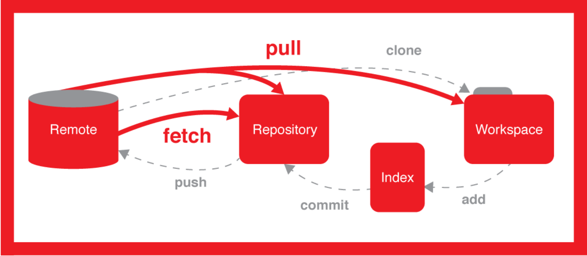

## Reset版本回退利器
#### 如果我们想回退到某个版本可以用git log查看，git log命令显示从最近到最远的提交日志如果嫌输出信息太多，可以试试加上--pretty=oneline参数;

* reset命令把当前分支指向另一个位置，并且有选择的变动工作目录和索引。也用来在从历史仓库中复制文件到索引，而不动工作目录。

* 如果不给选项（默认--mixed ），那么当前分支指向到那个提交。如果用--hard选项，那么工作目录也更新，如果用--soft选项，那么都不变。

* 如果没有给出提交点的版本号，那么默认用HEAD。这样，分支指向不变，但是索引会回滚到最后一次提交，如果用--hard选项，工作目录也同样。

* 如果给了文件名(或者 -p选项), 那么工作效果和带文件名的checkout差不多，除了索引被更新。

## git pull 和 git fetch 的区别
- 来一张珍藏的图
 
- git pull = git fetch + merge
- git fetch 拿到了远程所有分支的更新
- merge 动作的默认目标是当前分支
- merge 动作的来源则取决于你是否有 tracking


### Git pull 强制覆盖本地文件

```
    git fetch --all  
    git reset --hard origin/master 
    git pull
```

