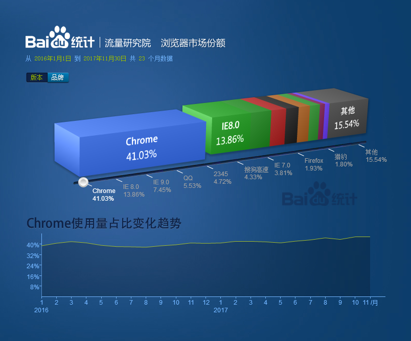
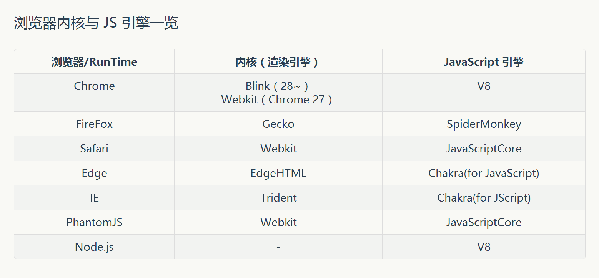

常见浏览器有哪些？哪些内核？
### 如图所示最近一年浏览器市场份额统计

### 常见的浏览器内核与js引擎

doctype有什么作用？怎么写？
###  首先<!DOCTYPE>告诉浏览器当前的HTML(或XHTML)文档是哪一个版本应该以何种规范去解析文档。Doctye是一条声明，而不是一个标签；是一个文档类型声明简称‘DTD’.
页面出现了乱码，是怎么回事？如何解决？
### 出现的原因
#### 网页源代码的编码方式与内容的文字编码类型不一致；因为浏览器不能自动检测网页编码故会造成乱码
### 解决
#### 使浏览器的解码和网页的源码编码方式一致 常见的字符编码方式为utf-8
meta 有哪些常见的值？
### HTML<meta>元素表示那些在<head><head/>标签中的元素不能表示的任何元数据信息

### 常见的值
- charset表示当前文档所使用的字符编码其值一般为utf-8
- content基于内容
- http-equiv（指定IE8去模拟某个特定版本的浏览器）
- name属性提供了与其相关的值得定义（name=“viewport”指定用户是否可以缩放页面）可以这么理解，手机浏览器是把页面放在一个虚拟的“窗口”（viewport）中，窗口可大于或小于手机的可视区域，一般手机默认viewport大于可视区域。这样不会破坏没有针对手机浏览器优化的网页的布局，用户可以通过平移和缩放来看网页的其他部分。
列出常见的标签，并简单介绍这些标签用在什么场景。
### HTML常用的标签
- div布局标签
- header头部标签
- input元素基于web表单创建交互式控件，常用来接受用户的输入
- button元素表示一个按钮
- nav元素定义导航链接
- main元素表示文档body或应用的主体部分
- section元素表示文档中的一个区域一般有标题和内容组成
- h1-h6元素是标题标签
- table元素表示表格数据，通过二维数据表表示信息
- p元素是段落标签
- img元素是图片标签
- form元素是表单标签
- time元素定义时间或日期标签
- video标签定义视频等
- audio元素定义声音等音频流
- canvas元素定义图形，自己没有行文把一个绘图API展现给客户端，使用js脚本绘制想要绘制的到画布上
- footer元素定义页脚
- ul元素代表多项的无序列表
- li元素被包含在ul或ol中或menu表示列表中的条目
- a元素可创建一个到其它地方的URL的超链接
- span元素无任何特殊意义用来增加类或id达到某种样式
- i元素斜体标签区分其它普通文本

title 属性和 alt属性分别有什么作用？
### img中title和alt的作用
- title 鼠标滑过显示提示文字信息，提升用户体验
- alt 图片无法正确显示的时候用文本替代显示

### web语义话的好处
+ 去掉样式后页面可以展现清晰的结构
+ 读屏器可以更好的阅读
+ 搜索引擎可以更好的理解页面
+ 易于后期维护
