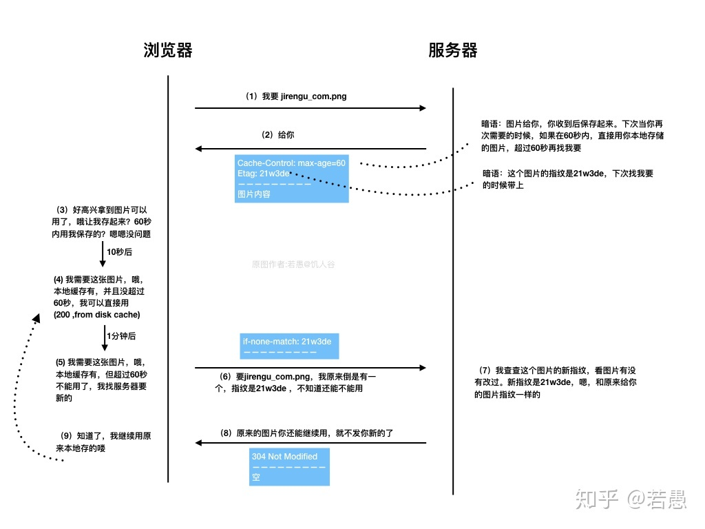
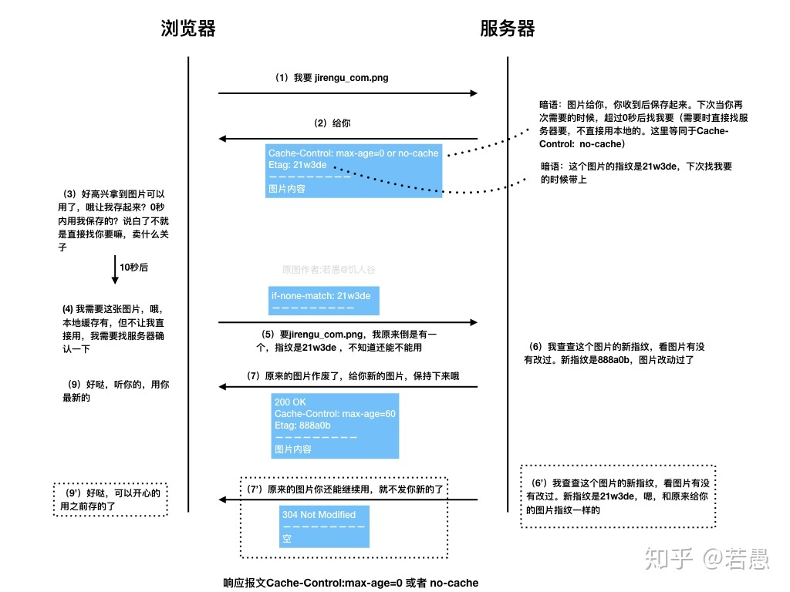
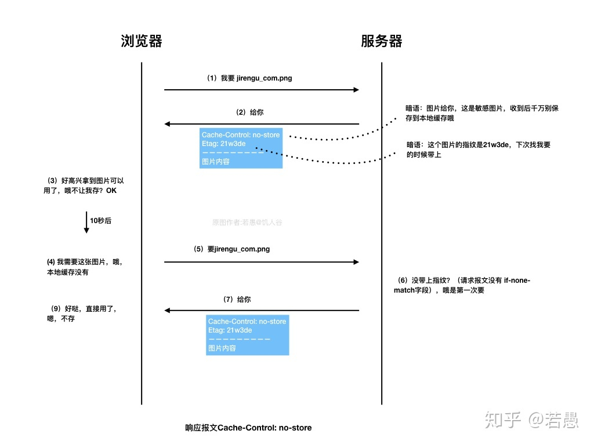
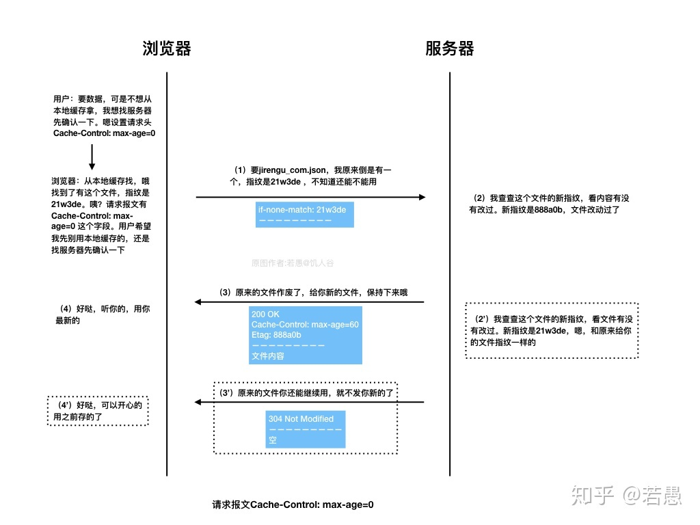
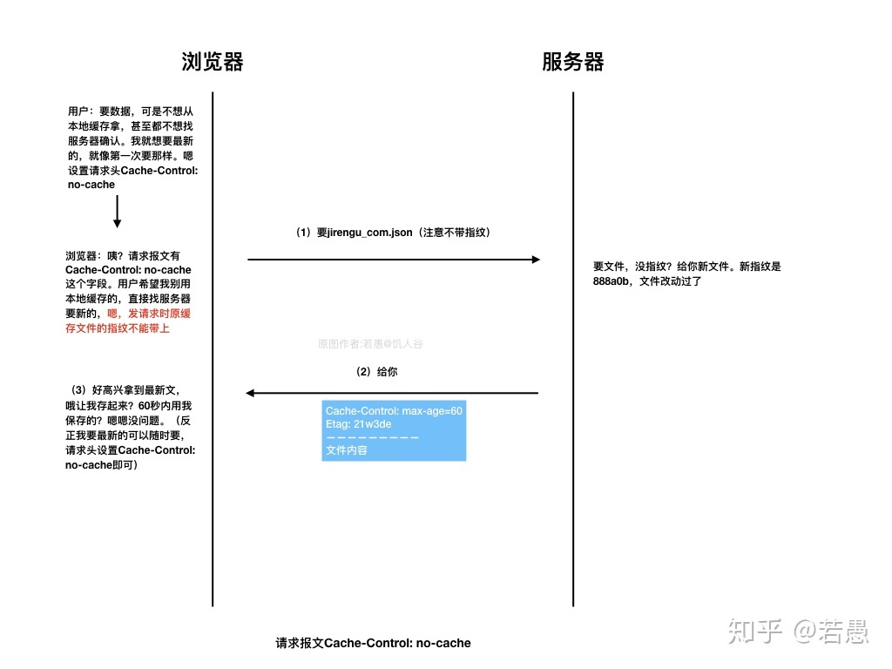

### 1. HTTP TCP/IP Socket 各代表什么

我们在传输数据时，可以只使用（传输层）`TCP/IP` 协议，但是那样的话便无法识别数据内容（没有应用层 `HTTP`），如果想要使传输的数据有意义，则必须使用到应用层协议，应用层协议有很多，比如 `HTTP、FTP、TELNET` 等，也可以自己定义应用层协议。 WEB 使用 `HTTP` 协议做应用层协议，以封装 `HTTP` 文本信息，然后使用 `TCP/IP`做传输层协议将它发到网络上。`HTTP` 是轿车，提供了封装或者显示数据的具体形式。

#### 1.1 是什么？

+ `HTTP`是应用层协议，为应用软件提供接口，比如： `http(80)、ftp(20/21)、telnet(23)、dns(53)、smtp(25)、pop3(110)`。
+ `TCP/IP` 协议是传输层协议，主要解决数据在网络中如何的传输。
+  `socket` 只是提供了一个针对 `TCP` 或者 `UDP` 编程的接口。

#### 1.2 他们之间的关系

+ 应用层的 `HTTP` 协议又是基于传输层的 `TCP` 协议的。传输层的 `TCP` 是基于网络层的 `IP` 协议的。

+ `socket` 是对 `TCP/IP` 协议的封装和应用，`socket` 本身并不是协议，而是一个调用的接口通过`socket` 我们才能使用 `TCP/IP`  协议。

    

### 2. 在浏览器中输入网址按下回车后发生了什么？

#### 2.1 最简单来说

1. 搜索浏览器自身的缓存;(浏览器会先检查是否有相应的cookie);
2. 搜索本机其它浏览器的缓存;
3. host解析;
#### 2.2 一般来说（一般的的HTTP请求，没有代理等等）

1. 首先浏览器会开启一个线程来处理这个请求;
2. 浏览器检查缓存;如果请求的对象在缓存中并且没有过期跳到到第7步;
3. 浏览器向操作系统请求服务器的IP地址（我们输入的一般是域名计算机会通过DNS解析成对应的IP地址）。宽带运营商服务器把结果返回给操作系统内核同时缓存起来， 操作系统内核把结果返回给浏览器，最终浏览器拿到对应的IP地址。我们访问百度的时候实际上访问的是百度的服务器，可以直接用下面的地址访问百度首页，但是百度在不同的地方有很多服务器我们应该用域名（baidu.com）去访问，由DNS决定我们访问哪个服务器一般是距离我们最近的.

4. 操作系统进行DNS查找并将IP地址返回给浏览器;
5. 浏览器发送请求，启动与服务器的TCP连接，进行协议回话，三次握手等；
6. 进入访问的目的服务器（Node.js，Apache等）寻找对应的请求;
7. 浏览器接收到HTTP响应，浏览器检查响应查看缓存上是否有对应的资源，是那种类型的相应，是重定向还是条件响应（304该资源在上次请求之后没有任何修改（这通常用于浏览器的缓存机制，使用GET请求时尤其需要注意），授权请求（401），错误（4xx和5xx）等。这些处理与正常响应不同（2xx）;
    * 1xx仅表示一条信息性消息
    * 2xx表示某种成功
    * 3xx将客户端重定向到另一个URL
    * 4xx表示客户端的错误
    * 5xx表示服务器内部出现错误
8. 浏览器渲染DOM（下载）CSS、图片等 js等服务器上的资源,并缓存起来，到此首次请求完成;
9. 接下来就是二者的交互如果存在的话，例如用户的验证，通过后服务器再把一些通过验证后的资源发送给浏览器;
10. 其实就是一个寻址的过程通过IP上的网络号和主机号进行寻址;
### 3. http

#### 3.1 请求格式

```
动词 路径 协议/版本
```
+ 请求最多包含四部分，最少包含三部分。（也就是说第四部分可以为空）
+ 第三部分永远都是一个回车（\n）
+ 动词有 GET POST PUT PATCH DELETE HEAD OPTIONS 等
+ 这里的路径包括「查询参数」，但不包括「锚点」
+ 如果你没有写路径，那么路径默认为 /
+ 第 2 部分中的 Content-Type 标注了第 4 部分的格式
+ put、patch都是更新put是整体更新、patch是局部更新
#### 3.2 状态码

+ 301 永久重定向
+ 302临时重定向
+ 304这一次的内容和上一次的内容一样
+ 4xx客户端错误
+ 5xx服务器内部错误
+ 500 通用错误，未给出具体的错误
+ 请求已成功，请求所希望的响应头或数据体将随此响应返回
#### 3.3 Http缓存控制机制




***

***

***

***

***
### 基础
1. Http协议是什么？有哪些特点？
2. 常见Http方法有哪些？使用场景分别是什么？
3. GET与POST有什么区别？
4. 在HTML的form 标签里，method支持哪些类型？
5. 状态码 200、301、302、304、403、404、500、503分别代表什么？
6. Web安全中有哪些常见的攻击方式？
7. URI和URL的区别？
    + URI是`Uniform Resource Identifier`的缩写,统一资源标识符,即由某个协议方案表示的资源的定位标识符
    + URI 用字符串标识某一互联网资源，而 URL表示资源的地点（互联网上所处的位置）。可见 URL是 URI 的子集<br>
    
8. 一次完整的Http请求所经历哪些步骤？
### 进阶
+ 说说Http协议的工作流程
+ Http请求报文与响应报文的格式？
+ Http首部包含哪些字段？举例说明
+ Https的原理是什么？
+ 浅析Http和Https的三次握手有什么区别。
+ 谈谈Session/cookie机制，如何实现会话跟踪？
+ 什么是Web缓存？原理如何？
+ OSI有哪七层模型？TCP/IP是哪四层模型。
+ 讲一讲 TCP 协议的三次握手和四次挥手流程。
+ 为什么 TCP 建立连接协议是三次握手，而关闭连接却是四次握手呢？为什么不能用两次握手进行连接？
+ websockt 是什么？和 Http 有什么区别？
### 高级
+ 什么是非持久连接，什么是持久连接？
+ Keep-Alive: timeout=5, max=100是什么意思？
+ http1.0，http1.1，http2.0区别（HTTP1.1版本新特性？HTTP2版本新特性？）
+ 对Http代理做个介绍？
+ 常见的鉴权方式有哪些？