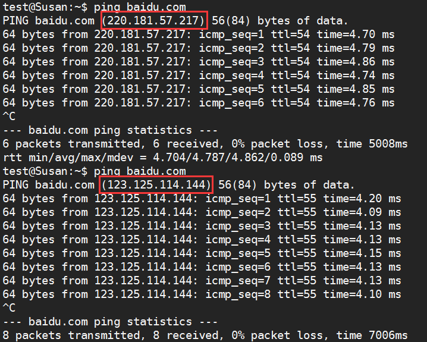

### HTTP TCP/IP Socket
+ 传输层的TCP是基于网络层的IP协议的，而应用层的HTTP协议又是基于传输层的TCP协议的，而socket只是提供了一个针对TCP或者UDP编程的接口
+ socket是对TCP/IP协议的封装和应用,socket本身并不是协议，而是一个调用的接口通过socket我们才能使用tcp/ip协议
+ TCP/IP协议是传输层协议，主要解决数据在网络中如何的传输
+ 而HTTP是应用层协议，主要用于如何包装数据
    ```
    “我们在传输数据时，可以只使用（传输层）TCP/IP协议，但是那样的话，如果没有应用层，便无法识别数据内容，如果想要使传输的数据有意义，则必须使用到应用层协议，应用层协议有很多，比如HTTP、FTP、TELNET等，也可以自己定义应用层协议。WEB使用HTTP协议作应用层协议，以封装HTTP文本信息，然后使用TCP/IP做传输层协议将它发到网络上。”
    HTTP是轿车，提供了封装或者显示数据的具体形式；Socket是发动机，提供了网络通信的能力。
    ```

## 在浏览器中输入网址按下回车后发生了什么？
### 最简单来说
1. 搜索浏览器自身的缓存;(浏览器会先检查是否有相应的cookie);
2. 搜索本机其它浏览器的缓存;
3. host解析;
### 一般来说（一般的的HTTP请求，没有代理等等）
1. 首先浏览器会开启一个线程来处理这个请求;
2. 浏览器检查缓存;如果请求的对象在缓存中并且没有过期跳到到第7步;
3. 浏览器向操作系统请求服务器的IP地址（我们输入的一般是域名计算机会通过DNS解析成对应的IP地址）。宽带运营商服务器把结果返回给操作系统内核同时缓存起来， 操作系统内核把结果返回给浏览器，最终浏览器拿到对应的IP地址。我们访问百度的时候实际上访问的是百度的服务器，可以直接用下面的地址访问百度首页，但是百度在不同的地方有很多服务器我们应该用域名（baidu.com）去访问，由DNS决定我们访问哪个服务器一般是距离我们最近的.

4. 操作系统进行DNS查找并将IP地址返回给浏览器;
5. 浏览器发送请求，启动与服务器的TCP连接，进行协议回话，三次握手等；
6. 进入访问的目的服务器（Node.js，Apache等）寻找对应的请求;
7. 浏览器接收到HTTP响应，浏览器检查响应查看缓存上是否有对应的资源，是那种类型的相应，是重定向还是条件响应（304该资源在上次请求之后没有任何修改（这通常用于浏览器的缓存机制，使用GET请求时尤其需要注意），授权请求（401），错误（4xx和5xx）等。这些处理与正常响应不同（2xx）;
    * 1xx仅表示一条信息性消息
    * 2xx表示某种成功
    * 3xx将客户端重定向到另一个URL
    * 4xx表示客户端的错误
    * 5xx表示服务器内部出现错误
8. 浏览器渲染DOM（下载）CSS、图片等 js等服务器上的资源,并缓存起来，到此首次请求完成;
9. 接下来就是二者的交互如果存在的话，例如用户的验证，通过后服务器再把一些通过验证后的资源发送给浏览器;
10. 其实就是一个寻址的过程通过IP上的网络号和主机号进行寻址;