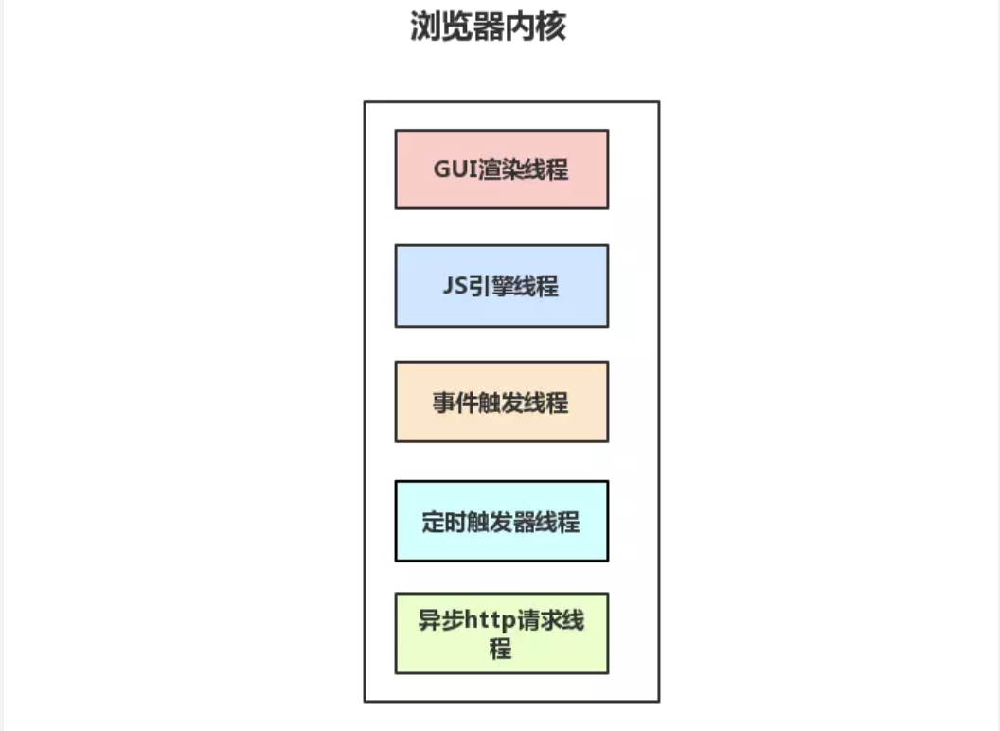
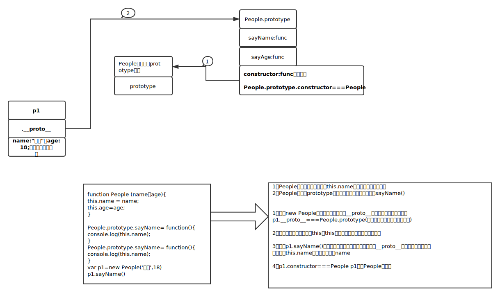

### 如何异步加载脚本
+ 一般的脚本后置可以使得页面更快的加载，如何当前执行的脚本比较耗时，就算后置它还是会阻塞后续脚本的加载，我们该怎么办
+ 通过defer延迟执行（告诉浏览器我不会修改DOM尽管加载） 一个带有defer属性的JavaScript文件下载时不会阻塞浏览器的其它进程，作用就是阻止脚本在加载完后立即执行，顺序加载延迟执行
+ 动态创建script标签添加属性值
+ 使用 XHR 对象下载 JavaScript 代码并注入页面中

```
var xhr = new XMLHttpRequest()
xhr.open('get', 'script.js',true)
xhr.onreadystatechange = function () {
    if (xhr.readyState = 4) {
        if (xhr.status >= 200 && xhr.status < 300 || xhr.status == 304) {
            var script = document.createElement('script')
            script.src = 'script.js'
            document
                .body
                .appendChild('script')
        }
    }
}
xhr.send(null)

```

### 浏览器的渲染机制
+ 解析HTML标签，构建DOM树
+ 解析CSS标签,构建CSSOM树
+ 解析JavaScript脚本，主要是通过DOM API 和CSSOM API来操作DOM Tree 和CSS Rule Tree
+ 解析完成后通过DOMTree和CSSTree来构造Rendering Tree，它并不等同于DOM树，浏览器计算每个元素的位置这个又叫layout和reflow
+ 最后调用操作系统的Native GUI的API进行绘制
- 解析 HTML 标签, 构建 DOM 树
- 解析 CSS 标签, 构建 CSSOM 树
- 把 DOM 和 CSSOM 组合成 渲染树 (render tree)
- 在渲染树的基础上进行布局, 计算每个节点的几何结构
- 把每个节点绘制到屏幕上 (painting)
- 浏览器会将各层的信息发送给GPU，GPU会将各层合成（composite），显示在屏幕上
- 渲染完毕就是load事件，之后就是JS逻辑处理

    (loading)[./img/loading.jpg]
#### load事件与DOMContentLoaded事件的先后
+ 当DOMContentLoaded事件触发时，仅仅是DOM加载完成、不包含css、img
+ onload事件触发、页面上所以的dom、css、img、js等都加载完毕（也就是页面渲染完毕了）
+ 加载的顺序是DOMContentLoaded -> load
### Repaint和Reflow
+ 二者的目的都是展现一个新的页面样貌
+ 网页生成的时候至少会渲染一次，渲染就需要从新生成布局和从新绘制前者叫重排（reflow）后者叫重绘（repaint）
+ 从新渲染触发的条件（修改DOM、修改样式表、用户事件）
+ repaint针对屏幕的中的一部分重新绘制（背景颜色等等，不改变该元素的位置大小）
+ reflow是回流对整个页面重排改变元素的几何位置大小等
+ repaint不一定触发reflow但reflow一定触发repaint

### 区分进程和线程
+ 一个进程包含多个线程
+ 进程是cpu资源分配的最小单位（可以查看资源管理器中的进程，系统给每个进程分配的cpu、内存等，），进程是独立的，是独立的一块内存
+ 线程是cpu调度的最小单位，线程是建立在进程基础上的一次程序运行单位。
+ 单线程与多线程程，都是指一个进程内的单和多。属于一个进程


### 浏览器是多进程的
+ shift+esc打开chrome的任务管理器查看具体包含的进程
+ 在浏览器中，每打开一个新的tab就相当于创建了一个独立的浏览器进程
+ 浏览器的主进程（Browser进程）负责协调、主控，只有一个
+ Browser进程的作用是：负责浏览器界面的显示、用户的交互（前进、后退等）、各个页面的管理、创建、销毁等，
+ Renderer进程得到的内存Bitmap，绘制到用户界面上。网络资源的管理、下载等
+ 浏览器的第三方插件，也会单独占一个进程（每个插件站一个）
+ 浏览器多进程的优势:如果浏览器是单进程，那么某个Tab页崩溃了，就影响了整个浏览器，体验有多差；同理如果是单进程，插件崩溃了也会影响整个浏览器；而且多进程还有其它的诸多优势。

### 浏览器内核（渲染进程,包含多个线程）
    
+ 普通的前端操作就是渲染进程、页面的渲染、JS的执行、事件的循环、都是在这个进程中进行
+ 浏览器的渲染进程是多线程的
    #### GUI渲染线程
    + 负责渲染浏览器页面、解析HTML、CSS、构建DOM树和RenderObject树、布局和绘制
    + 当界面需要重绘（Repaint）或由于某种操作引发的回流（Rflow）时、改线程就会执行
    + GUI的渲染线程和JS引擎的线程是互斥的（不互斥的话JS线程和GUI线程同时运行就会造成渲染线程前后获得的数据不一致），当JS引擎的线程执行是GUI的线程会被挂起，GUI更新保存在一个队列中等到JS引擎空闲时立即被执行
    #### JS引擎线程
    + 也是JS内核，负责处理JavaScript脚本程序（chrome的v8引擎）
    + JS引擎一直等待着任务队列中的任务到来，一个Tab页面（Render进程）中无论什么时候都只有一个JS线程在执行JS程序
    + JS引擎因为和GUI互斥、所以如果JS加载的时间过长、就会造成页面渲染的不连贯、导致页面渲染加载阻塞
    #### 事件触发线程
    + 浏览器自身（冒泡、委托）用来控制事件循环
    + 当JS引擎在执行代码块如setTimeOut()的时候（也可以是其它浏览器内核的线程、鼠标点击、Ajax异步请求等）会将相应的事件添加到事件线程中，当对应的事件符合条件的时候会被触发、该线程会把事件添加到待处理队列的队尾、等待JS引擎的处理
    + 因为JS是单线程的，所以等待队列中的事件都要排队等待JS引擎的处理（JS引擎空闲的时候才处理）
    #### 定时器触发线程
    + setInterval、setTimeout（通过单独的线程来处理计时器、计时完毕后添加到任务队列，等待JS引擎空闲的时候去执行）
    + JS引擎太忙需要单独的线程来处理（JS是单线程的）
    #### 异步HTTP请求
    + 在XMLHttpRequest() send()后是通过浏览器来新开一个线程请求
    + 当状态变更时候（unset、opened、loading、done）如果设置的有callback异步线程就会产生状态变更事件，将这个callback再放到事件队列中，由JS引擎的执行

### EventLoop
+ 这里是JS引擎运行机制的一些分析
+ JS分为同步任务和异步任务（同步任务在主线程上执行形成一个执行栈）
+ 主线程之外、事件触发的线程管理着一个任务队列、只要异步任务有了运行结果，就在任务队列中放置一个事件
+ 一旦主进程空闲（执行栈）执行完毕，系统就会读取任务队列中的事件，将满足条件的异步任务添加到执行栈中
    !()["./img/event.jpg"]
    !()["./img/event-loop.jpg"]
    + 主线程运行时会产生执行栈，栈中的代码调用某些api时，它们会在事件队列中添加各种事件（当满足触发条件后，如ajax请求完毕）
    + 而栈中的代码执行完毕，就会读取事件队列中的事件，去执行那些回调
    + 如此循环(总是要等待栈中的代码执行完毕后才会去读取事件队列中的事件,这就是为什么setTimeout(fn(),0)后执行)

    #### 用setTimeout模拟setInterval（定时器中给出的时间间隔不是时间到了立即去执行，而是时间到后加入任务队列，如果任务对列中没有别的事件那么就会执行，如果有其它事情可能会延迟执行）
    + setTimeout的执行时间间隔是延迟时间+代码执行时间
    + setInterval的执行时间的间隔是设置的最小延迟时间（执行时间小于等于延迟时间）最大执行时间（执行时间大与设定的延迟时间）

        ```
        var time=function(a){
            var _this=this
            this.timer=setTimeout(function(_a){
               //do
                _this.time(_a)
            },1000)
        }

        ```

### let和const
+ let的作用域为{let xx=xx} 在作用域中不能够在 let xx 不能再let xx 前调用 xx 
+ const和let一样除了cost是常量不能够重复赋值以外（只能够赋值一次且必须赋值）
+ 能用const就不用let

### javascript中数据类型
+ 基本类型（值类型）指的的是可以直接存储的类型（null、undefined、Boolean、string、number、symbol）
+ 复杂类型（引用类型）
### NaN 
+ NaN(not a number)是一个全局对象的属性、不可配置、不可写在ES5中
+ typeof NaN是number 也是一种数字的特殊类型，代表不是一个数字，代表一些不能由数值范围表示的类型 NaN===NaN 结果为false 因为它们可能是不同的值
+ 一般用typeof value === 'number' && isNaN(value); 来判断一个值是否是NaN
### ==与===有什么区别？
+ “==”是比较强制类型转换之后的结果，“===”则是直接比较
+ “==”比较的时候会发生数据类型的转换当和一个Boolean值进行比较得时候javascript会将这个Boolean值转换为number类型再进行比较，赋值表达式不具有比较作用
+ “===”是严格相等运算符即判断等号两侧的数据类型是否一致（不一致直接返回false），又判断value是否相等，比较的时候不会发生数据类型的转换
+ 一些特殊的比较示例
    ```
    false == ""  // true
    false == []  // true
    false == {}  // false
    "" == 0      // true
    "" == []     // true
    "" == {}     // false
    0 == []      // true
    0 == {}      // false
    0 == null    // false

    ```
### null和undefined
+ 二者在if语句中会自动转换为false
### Boolean
+ 除了undefined、null、false、0、NaN、""/'' 都会转换为true
+ 空数组[]和空对象对应的Boolean值都是true

### Array
+ forEach(item)让数组中每一项做一件事
+ map让数组通过计算产生一个新数组
+ 

### 作用域

+ 在整个JavaScript中，全局变量的作用处处都存在。定义在script块中，在function函数外
+ 局部变量的作用是局部性的，在函数的内部或函数参数定义时，作用范围是从函数开始到结尾在{}中

### 立即执行函数表达式
+ 在JavaScript里每个函数，调用时，都会创建一个新的执行上下文，函数提供的上下文又提供了一个非常简单的方法去创建私有变量
+ 定义一个函数var fn=function(){}（这是函数表达式）;function fn(){}（这是函数声明）,当调用时需要在后面加上一个'()'使用不带圆括号的的函数名是访问函数的指针，而非调用的函数，因为函数是对象，函数名是指针
+ 函数声明和函数表达式除了什么时候可以通过变量访问函数这一点区别之外二者的语法是等价的
+ 将函数声明包含在圆括号里面构成了一个函数表达式(function(){})(),当圆括号出现在函数的末尾想要调用函数时。它将函数当成是声明函数
+ 当圆括号包裹函数时，它会默认将函数当作表达式去解析，而不是去声明
+ 它的作用就是隔离作用域（减少全局变量防止变量污染），es6之前JS不提供块级作用域只能用函数作用域模拟
+ 还有就是立即调用后就被回收了，var test(function(){doXXX return})()里面可以做事情不影响外面，就是一个块级作用域

#### 作用域链
+ 有两种作用域,函数作用域和全局作用域
+ 闭包:函数连同它作用域上的变量,共同构成了闭包,为了封装数、暂存数据。
我们先看一下闭包是如何工作的
```
var currentScope = 0; 
(function () {
  var currentScope = 1, one = 'scope1';
  alert(currentScope);
  (function () {
    var currentScope = 2, two = 'scope2';
    alert(currentScope);
    (function () {
      var currentScope = 3, three = 'scope3';
      alert(currentScope);
      alert(one + two + three); 
    }());
  }());
}());
```
- **上面的嵌套函数时会形成闭包，当父函数立即执行后，内部函数也可以引用其外部封闭函数中存在的变量**
- **JavaScript通过遍历的方式来查找变量**
- **在第三个函数中，第二个、第一个、和全局的声明的currentScope的变量被隐藏，其值保持不变，第三个又声明了currentScope当访问该范围的是此currentScope作为此立即执行函数表达式的作用域链中的第一个**
- 函数在执行的过程中，先从自己内部内部找变量
- 如果找不到，再从创建当前函数所在的作用域(词法作用域)去找，以此往上
- 注意找的是变量当前的状态
+ 深拷贝和浅拷贝（首相明白基本类型，像number，string、Boolean。复杂类型array、object）
+ 浅拷贝拷贝和被拷贝对象的指针指向相同的地址，修改其中的任意一个值另一个值都会随之变化，这就是浅拷贝
+ 深拷贝（完全复制了一份）当拷贝对象放到了新的内存中有了新的地址，和被拷贝对象的不同，修改任意值另一个不会发生改变
```
var newObj=JSON.parse(JSON.stringify(oldObject))
```


#### this
+ 在全局执行上下文中（在任何函数体外部），this都指代全局对象（window,nodejs环境是global），上下文就是函数的执行环境
+ 在函数内部this的值取决于函数被调用的方式,看是谁去调用的
+ 如果把this的值从一个执行上下文传到另一个（改变this的指向）用到call或apply方法
+ (()=>{console.log(this)})()//this===windows.this 跳出箭头函数本身去外层find this
```
function add(c, d) {
  return this.a + this.b + c + d;
}

var o = {a: 1, b: 3};

// 第一个参数是作为‘this’使用的对象
// 后续参数作为参数传递给函数调用
add.call(o, 5, 7); // 1 + 3 + 5 + 7 = 16

// 第一个参数也是作为‘this’使用的对象
// 第二个参数是一个数组，数组里的元素用作函数调用中的参数
add.apply(o, [10, 20]); // 1 + 3 + 10 + 20 = 34
```

```
var app = {
    fn1() {
        setTimeout(function(){
            console.log(this)
        }, 10)
    },
    fn2() {
        setTimeout(()=>{
            console.log(this)
        },20)
    },
    fn3() {
        setTimeout((function(){
            console.log(this)
        }).bind(this), 30)        
    },
    fn4: ()=> {
        setTimeout(()=>{
            console.log(this)
        },40)        
    }
}
    app.fn1()//Window {postMessage: ƒ, blur: ƒ, focus: ƒ, close: ƒ, frames: Window, …}
    app.fn2()//{fn1: ƒ, fn2: ƒ, fn3: ƒ, fn4: ƒ}
    app.fn3()//{fn1: ƒ, fn2: ƒ, fn3: ƒ, fn4: ƒ}
    app.fn4()//Window {postMessage: ƒ, blur: ƒ, focus: ƒ, close: ƒ, frames: Window, …}
```
+ 每个新定义的函数都有它自己的 this值(箭头函数不绑定this，它使用封闭执行上下文中的this值)


### 原型和原型链

```
    var log=console.log.bind(console)
    // 构造函数
    // Person中有个prototype
    function Person(name,age){
            this.name=name
            this.age=age
            this.sayName=function(){
                console.log(this.name)
        }
    }
    // new出来的p1中有个__proto__
    // __porto__又指向Person的prototype
    // 创建一个对象或是创建一个实例 new的过程给this赋值就是给这个对象赋值，完成以后把这个对象return出来赋值给p1
    // 通过new方法创建的对象会有一个__proto__的属性
    var p1=new Person('xiaoqi',18)
    log(p1.sayName())

```
+ 变量是属性，函数是方法
+ 任何对象，都有创建者，这个创建者是个函数，普通的对象都是Object创建的
+ 创建这个对象的__proto__属性执行构造函数的prototype
+ 例如数组是Array创建的，调用数组的方法[1,2].join()查找[1,2].proto.join()查找Arry.prototype.join().那么Array又是谁创建的,Array.prototype又是谁创建的
+ 一个对象查找自己的方法属性的时候先从自己的本身去找，然后找自己的原型__proto__,再去从创建它的那个函数的prototype去找，然后去Object.prototype上去找，最后找Object.prototype.__proto__===null找不到的结果

```
    Array.__proto__===Function.__proto__
    Function.__proto__===Function.__proto__
    Array.prototype.__proto__===Object.prototype
    Object.prototype.__proto__===null
```

### 继承
+ 继承就是一个对象直接使用另一个对象的属性和方法
+ Object.create()


#### bind call apply
+ 函数的绑定，函数作用参数传递的同时，可以存储函数的作用域
+ bind的实现是对作用域的绑定，第一个参数表示作用域，更改作用域不执行参数,还可以传递参数,执行bind后返回了一个新的函数，可以用来改变回调函数的作用域,bind的实现利用call和apply
```
function bind(fn, content) {
    // bind(返回的函数，绑定函数，传入的参数)
    var args=Array.prototype.slice.call(arguments,2)
    // 返回一个新的函数
    return function () {
        // 获取执行函数时传递的参数
        var lave=Array.prototype.slice.call(arguments)
        //把原来的参数与fn的参数拼接
        var nowArr=args.concat(lave)
        fn().apply(content, nowArr)
    }
}
bind('当前函数','绑定的作用域函数',arguments)

var log=bind(console.log,console)//log()

var log =  console.log.bind(console)//log()
```
+ call和apply，都是在使用（使用即执行）的时候改变作作用域，第一个参数都表示作用域，一旦改变作用域函数就执行了
```
var obj = {
    speed: 0
}

function call() {
    console.log(this.speed)
}

var newCall = call.bind(obj, undefined) //返回新函数
newCall() //o
call() //undefined
call.call(obj, undefined) //0
call.apply(obj, [undefined]) //0
```

+ call从第二个参数开始表示传递参数
+ apply第二个参数是数组（每一个成员表示一个将被传入的参数）
#### 函数柯里化
+ 一个接收多个参数的函数，我们可以一个一个传递参数，当函数执行的时候传递剩余的参数
+ 增强函数的适用性，类似于重载（重载是在内部实现的，柯里化是在外部实现的）
```
/**
 * 函数柯里化
 */

 function curry(fn,content){
    // 将传入的参数，转化为数组
    var args=Array.prototype.slice.call(arguments,1)
    return function(){
        
        // 剩余传递的参数用户添加的
        var laveArgs=Array.prototype.slice.call(arguments)

        // 数组拼接
        var  nowArr=args.concat(laveArgs)
        return fn.apply(null.nowArr)
    }
 }
```
#### create实现一个原子的继承
```
function create(obj){
    //寄生工厂模式
    // 实现寄生类
    function Fn(){}
    //让类的原型继承参数对象
    Fn.prototype=obj
    // 返回这个实例化对象
    return new Fn()
 }
var xiaoming=create(person)
```
#### JSON规范
+ 首先json是一种用于数据交换的文本格式，是一种文本格式
+ json类型对值和类型有严格的规范
+ 复杂类型不能是function、regexp、date
+ 简单类型只有四种基本类型，string、number、null、Boolean
+ 字符串必须使用双引号表示、不能使用单引号表示
+ 对象的键名必须放到双引号的后面
+ 数组或对象最后一个成员的后面,不能加逗号
+ 空数组和空对象也是合格的JSON值,null也是合格的json值
+ JSON对象提供了两种方法JSON.stringfiy()和JSON.parse()

#### 事件
+ javascript采用异步事件驱动编程模型
+ 事件的三种模型：事件冒泡、事件捕获、DOM事件流（事件捕获阶段、处于目标阶段、事件冒泡阶段，首先发生的是事件捕获、为截取事件提供机会、然后实际目标接受事件，最后是冒泡阶段）
+ 事件处理程序，事件侦听器（listener）就是响应某个事件的方法N
#### 事件传播机制
+ 事件冒泡（事件开始由较为具体的元素接收，然后逐级向上传播到较为不具体的元素）
+ 事件捕获（不太具体的结点更早的接收事件，最具体的元素最后接收到事件，和事件冒泡相反）
+ DOM2事件（DOM2事件的三个阶段，事件捕获阶段、处于目标阶段、事件冒泡阶段、首先发生事件捕获、然后为截取事件提供机会、然后是目标接收事件、最后事冒泡阶段）
  


### 阻止传播
+ event.preventDefault() 如果事件可以取消，则取消该事件，但是不影响事件的下一步传播
+ event.stopPropagation()阻止捕获和冒泡阶段中当前事件的进一步传播
+ event.target()事件代理，或则事件委托在子元素的上级结点（一般是父节点）处理子元素的上的触发事件

### BOM
+ BOM有多个对象组成，其中window对象是BOM最顶层的对象，其它对象都是该对象的子对象
+ 判断浏览器的类型
```
/ Opera 8.0+
var isOpera = (!!window.opr && !!opr.addons) || !!window.opera || navigator.userAgent.indexOf(' OPR/') >= 0;

// Firefox 1.0+
var isFirefox = typeof InstallTrigger !== 'undefined';

// Safari 3.0+ "[object HTMLElementConstructor]" 
var isSafari = /constructor/i.test(window.HTMLElement) || (function (p) { return p.toString() === "[object SafariRemoteNotification]"; })(!window['safari'] || (typeof safari !== 'undefined' && safari.pushNotification));

// Internet Explorer 6-11
var isIE = /*@cc_on!@*/false || !!document.documentMode;

// Edge 20+
var isEdge = !isIE && !!window.StyleMedia;

// Chrome 1+
var isChrome = !!window.chrome && !!window.chrome.webstore;

// Blink engine detection
var isBlink = (isChrome || isOpera) && !!window.CSS;

```

### session&cookie&localStorage
+ session是一种抽象的概念（存在文件、数据库、内存中），HTTP协议中定义在header中的字段。可以认为是session的一种后端无状态的实现。cookie是实际存在的东西
+ 由于HTTP协议是无状态的的，当服务端需要记录用户的的状态时就需要某种机制，这种机制就是session。如购物车，这个session由服务端创建，并保存在服务端。
+ 而服务端如何识别特定的session如用户身份信息,每次HTTP请求的时候客户端都会发送相应的cookie到服务端，在第一次会话的时候，服务端会在HTTP协议中告诉客户端需要在cookie里面记录一个sessionID在以后的每次请求中都把这个ID发送到服务端，这一年服务的就知道是那个session，如果禁用cookie会使用一种叫做URL重写的技术来进行会话跟踪，每次HTTP交互，URL后面都会跟上以分sid=XXX这样的参数，服务端据此来识别用户
+ cookie是用来跟踪会话是客户端用来保存用户信息的一种机制，用来记录用户的一些信息，也是实现session的一种方式
+ localStorage是HTML5中作为持久保存客户端数据（一般是5M）的方案取代了globalStorage相当于globalStorage[location.host],想访问同一个localStorage页面必须来自同一域名、协议、端口号


### Ajax
+ 我们使用XMLHttpRequest()对象来发送Ajax请求
+ xhr.status（200、304等）是服务器的一个状态，xhr.readyState是一个交互的过程(1:'open'2:'header_received'3:'loading'4:'done')
```
function ajax(obj){
    var type=obj.type||'GET'
    var url=obj.url
    var dataType=obj.dataType||'json'
    var onsuccess=obj.onsuccess||function(){}
    var  onerror=obj.onerror||function(){}
    var data=obj.data||{}


    // 请求的参数 

    var datastr=[]

    for(var key in datastr){
        datastr.push(`key=${datastr[key]}`)
    }
    datastr.join('&')
  
    if(obj.type==='GET'){
        url+='?'+datastr
    }

    var xhr=new XMLHttpRequest()
    xhr.open(type,url,true)

    xhr.onload=function(){
      if(xhr.status>=200&&xhr.status<300||xhr.readyState==304){
          if(dataType=='json'){
              onsuccess(JSON.parse(this.responseText))
          }else(
              onsuccess(this.responseText)
          )
      }else{
          onerror()
      }
    }
    xhr.onerror=onerror
    if(type==='POST'){
        xhr.send(datastr)
    }else{
        xhr.send()
    }
}
```