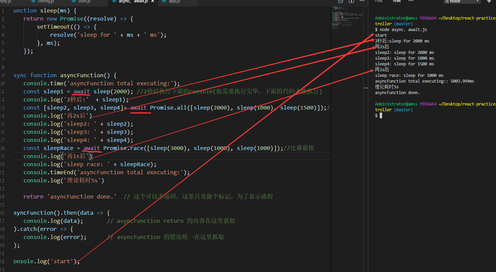

### async/await的基础用法

> 致谢：[888](https://www.jianshu.com/p/ffa5cbe9ab29)

####  async 用于申明一个 function 是异步的，而 await 用于等待一个异步方法执行完成，async返回的是一个Promise对象

```
    function sleep(ms) {
    return new Promise((resolve) => {
        setTimeout(() => {
            resolve('sleep for ' + ms + ' ms');
        }, ms);
    });
 }
    async function asyncFunction() {
        console.time('asyncFunction total executing:');
        //2秒后执行下面的console(他需要执行完毕，下面的代码才能执行)
        const sleep1 = await sleep(2000); 
        console.log('2秒后:'  + sleep1);
        //同理2秒后执行下面的console，看谁最慢，执行时间是最慢的那一个
        const [sleep2, sleep3, sleep4]= await Promise.all([sleep(2000), sleep(1000), sleep(1500)]);
        console.log('再2s后')
        console.log('sleep2: ' + sleep2);
        console.log('sleep3: ' + sleep3);
        console.log('sleep4: ' + sleep4);
        const sleepRace = await Promise.race([sleep(3000), sleep(1000), sleep(1000)]);//比谁最快
        console.log('再1s后')
        console.log('sleep race: ' + sleepRace);
        console.timeEnd('asyncFunction total executing:');
        console.log('理论耗时5s')
        
        return 'asyncFunction done.'  // 这个可以不返回，这里只是做个标记，为了显示流程
    }
    asyncFunction().then(data => {
        console.log(data);       // asyncFunction return 的内容在这里获取
    }).catch(error => {
        console.log(error);      // asyncFunction 的错误统一在这里抓取
    });

    console.log('start');

```
+ async/await的作用主要体现在级联调用
+ async/await从上到下，顺序执行，就像写同步代码一样。
+ async函数，如果里面有异步过程，会等待；但是async函数本身会马上返回，不会阻塞当前线程。
> 可以简单认为，async函数工作在主线程，同步执行，不会阻塞界面渲染。
async函数内部由async关键字修饰的异步过程，工作在相应的协程上，会阻塞等待异步任务的完成再返回。上面的文章很好地解释了这几个概念的区别。
如果不纠结细节，可以简单地认为：进程 > 线程 > 协程；
协程可以独立完成一些与界面无关的工作，不会阻塞主线程渲染界面，也就是不会卡。
协程，虽然小一点，不过能完成我们程序员交给的任务。而且我们可以自由控制运行和阻塞状态，不需要求助于高大上的系统调度，这才是重点。
### await关键字使用时有哪些注意点？
+ 只能放在async函数内部使用，不能放在普通函数里面，否则会报错。
+ 异步过程需要包装成一个Promise对象，放在await关键字后面。

+ await是async wait的意思，wait的是resolve(data)消息，并把数据data返回。比如，下面代码中，当Promise对象由 Pending变为Resolved的时候，变量a就等于data；然后再顺序执行下面的语句console.log(a);
这真的是等待，真的是顺序执行，表现和同步代码几乎一模一样。
```
const a = await new Promise((resolve, reject) => {
    // async process ...
    return resolve(data);
});
console.log(a);
```

+ await 命令后面的 Promise 对象，运行结果可能是 rejected，所以最好把 await 命令放在 try...catch 代码块中。
+ 让await后面的Promise对象自己catch
```
  const exitUser = await UserModel.findOne({mobile}).catch(err=>{
                console.log(err)
            })
```


