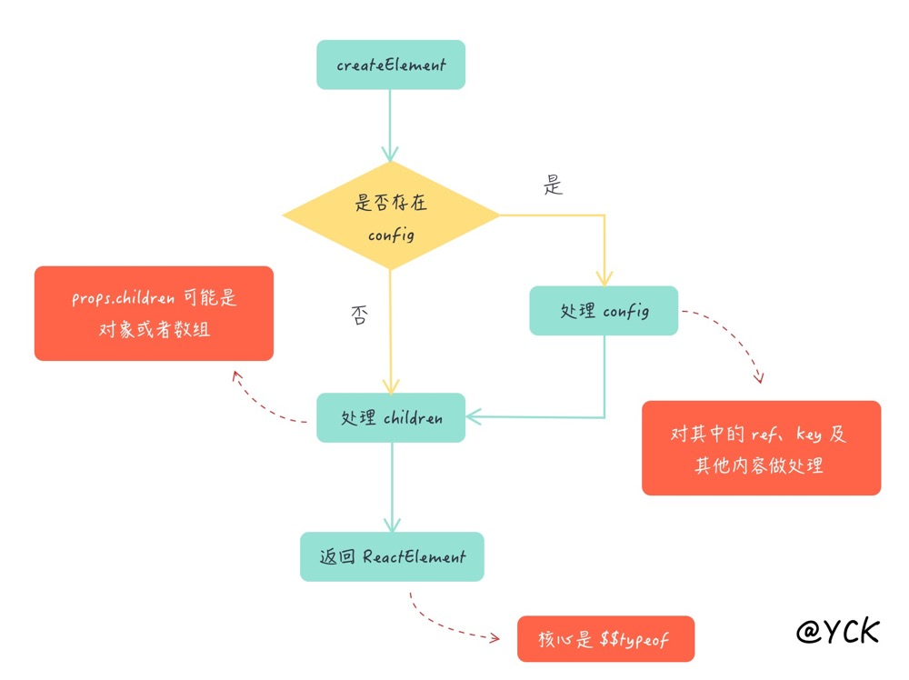
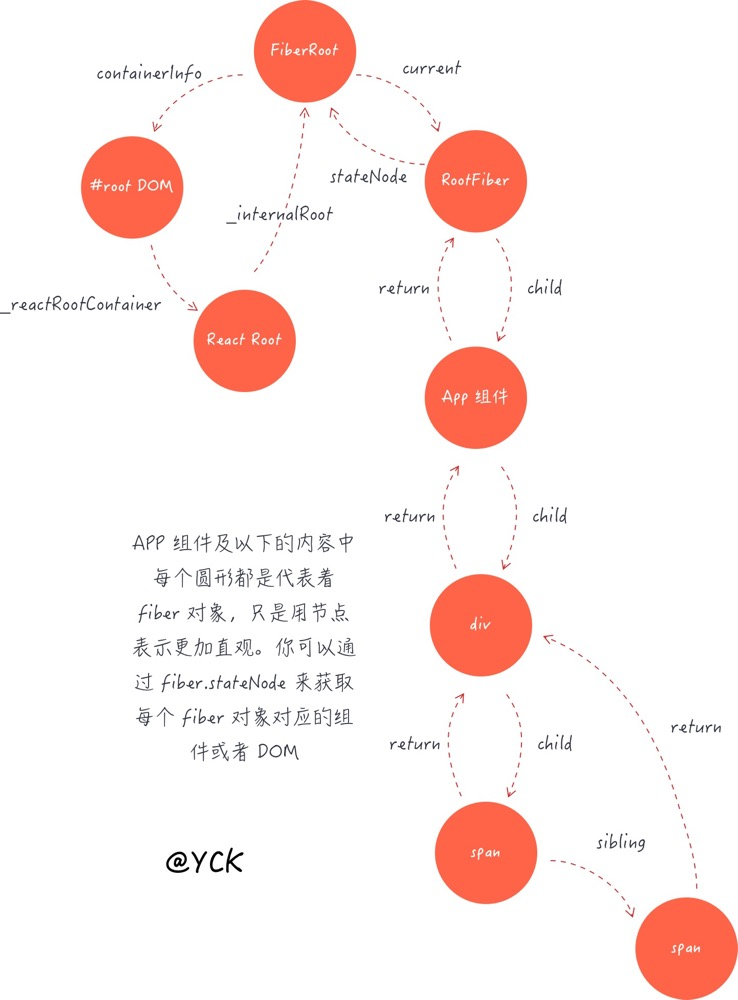
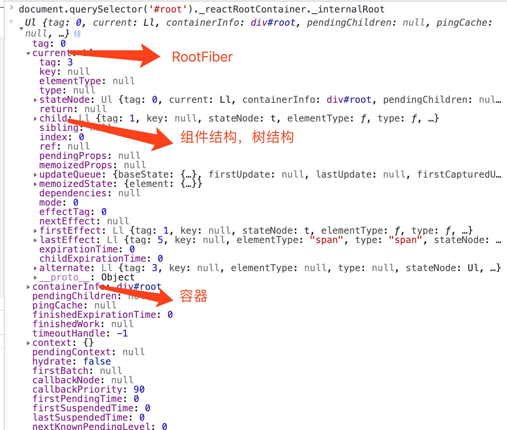

## React & Redux 进阶

### 1. React 的思想

- 虚拟 DOM

- 标签就是函数，标签的属性就是函数的参数

  ```jsx
  <Parent name={this.state.name} />
  ```

- 我们自定义组件的时候必须要**大写开头**，因为只有这样 `createElement` 把组件当成一个变量而不是字符串。

  ```js
  function createElement(type, config, children) {
    //...
    return ReactElement(
      type,
      key,
      ref,
      self,
      source,
      ReactCurrentOwner.current,
      props
    )
  }
  // 创建 ele 内部有 $$typeof 标识这是一个 ReactElement
  const ReactElement = function (type, key, ref, self, source, owner, props) {
    const element = {
      $$typeof: REACT_ELEMENT_TYPE,
      type: type,
      key: key,
      ref: ref,
      props: props,
      _owner: owner,
    }
    return element
  }
  ```

  ```jsx
  ;<div class="container">
    parent
    <p>
      <span>span</span>
    </p>
    <div>div</div>
  </div>
  // 转换为 每一个节点都需要 React.createElement 进行创建
  React.createElement(
    "div",
    {
      class: "container",
    },
    "parent",
    React.createElement("p", null, React.createElement("span", null, "span")),
    React.createElement("div", null, "div")
  )
  ```

  **ReactElement 的核心是 \$\$typeof**

  

  - 组件名不能是表达式，应该是以大写字母开头的变量。

  - 我们写的 `<Com/>` 代表 `ReactElement` ，`Com` 代表 `Component`



- 在 `react` 中一切皆可 `props`

  - 包括基本数据类型，React 元素以及函数。

  - `props`的默认值为 `true`

    ```jsx
    <Com loading />
    // 二者等价
    <Com loading={true} />
    ```

- `jsx` 可以进行字符串字面量转移，防止 `xss` (跨站脚本攻击) 。

#### 1.1 组件的创建更新过程

`<Foo/>` 组件，`Foo` 代表 `React Component`

我们看下组件的构造函数

```js
// updater 是 react-dom 的内容
function Component(props, context, updater) {
  this.props = props
  this.context = context
  this.refs = emptyObject
  this.updater = updater || ReactNoopUpdateQueue
}

Component.prototype.isReactComponent = {}

Component.prototype.setState = function (partialState, callback) {
  this.updater.enqueueSetState(this, partialState, callback, "setState")
}

Component.prototype.forceUpdate = function (callback) {
  this.updater.enqueueForceUpdate(this, callback, "forceUpdate")
}
```

`react` 中有三种创建更新的方式

- 通过 `ReactDom.render()` || `hydrate` 初次渲染

- 通过 `setState` 更新

- 通过 `forceState` 更新

##### 1.1.1 ReactDom.render 的过程

- 先创建一个 `ReactRoot` 顶点对象

  app.js

  ```jsx
  // 根据给 createElement 传了一个 APP 类
  ReactDOM.render(<App />, document.getElementById("root"))
  ```

  ```js
  // 源码 ReactDOM.js
  function ReactRoot(
    container: DOMContainer,
    isConcurrent: boolean,
    hydrate: boolean
  ) {
    // 这个 root 指的是 FiberRoot
    // createContainer 平台、任务调度的东西
    // createContainer => return createFiberRoot(containerInfo, isConcurrent, hydrate);
    const root = createContainer(container, isConcurrent, hydrate)
    this._internalRoot = root
  }
  ```

  到这里就创建了一个 root 对象，react 在创建对象的时候会把根节点内的所有元素都移除。我们一般都写成 `<div id="root"></div>` 没有子元素

- 再创建 `FiberRoot` 和 `RootFiber`，二者是非常重要的 `api`

  - `fiber` 和 Fiber 是两个不一样的东西，前者代表着数据结构，后者代表着新的架构。

  - 每一个`dom` 节点对应着一个 `fiber` 对象

  - **`FiberRoot` 就是整个 `fiber` 树的根节点**

  ```js
  function ReactRoot(
    container: DOMContainer,
    isConcurrent: boolean,
    hydrate: boolean
  ) {
    // 这个 root 指的是 FiberRoot 这里创建了一个 FiberRoot
    const root = createContainer(container, isConcurrent, hydrate)
    this._internalRoot = root
  }
  ```

  - 因为有 react 16 有任务优先级的概念，同一时间有任务优先级不同的任务。

##### 1.1.2 FiberRoot

- FiberRoot 是整个应用的起点

- 包含应用挂载的目标节点（）

- 记录整个应用更新过程的各种信息

  - 在 react 里面，通过 `this.props.child` 拿到子节点

```js
// react fiberRoot 中的数据结构
type BaseFiberRootProperties = {
  // 容器，也就是 render 的第二个参数
  containerInfo: any,
  // Used only by persistent updates.
  // 只在持续更新中使用
  pendingChildren: any,
  // The currently active root fiber. This is the mutable root of the tree.
  // 当前的 fiber 对象，也就是 root fiber
  current: Fiber, // 指向 RootFiber
  // 用来存放 update，也就是用来记录改变状态的
  updateQueue: UpdateQueue<any> | null,
  ...
}
```

##### 1.1.3 RootFiber

- `fiber` 会组成一个树结构，内部使用了单链表树结构，每个节点及组件都会对应一个` fiber`

<!---->

- 父节点只有一个子节点，而每个子节点又有兄弟节点（`sibling`）,还有一个 `return` 指回了父节点。

  

- 对应 `Dom` 结构如下

  

##### 1.1.4 render

- `updateContainer`

- `currentTime` 代表 `react` 初始化的时间

- `expirationTime` 代表更新的优先级

  - 指一个任务的过期时间，`expirationTime` 大于当前时间 `react`就会延迟执行这个任务

    - `sync `的数字是最大的，所以优先级也是最高的

    - 交互事件 优先级较高

    - 异步事件 优先级最低

  - 高优先级可以打断低优先级的执行

    - 这样就造成了某些生命周期函数的多次执行

```js
ReactRoot.prototype.render = function (
  children: ReactNodeList,
  callback: ?() => mixed
): Work {
  // 这里指 FiberRoot
  // document.querySelector('#root')._reactRootContainer 可进行查看
  const root = this._internalRoot
  // ReactWork 的功能就是为了在组件渲染或更新后把所有传入
  // ReactDom.render 中的回调函数全部执行一遍
  const work = new ReactWork()
  callback = callback === undefined ? null : callback
  // 如果有 callback，就 push 进 work 中的数组
  if (callback !== null) {
    work.then(callback)
  }
  // work._onCommit 就是用于执行所有回调函数的，就是我们传进来的 callback
  // updateContainer(<App/>,'root节点',parentComponent,callback)
  // 这里的 parentComponent react采用了硬编码直接为 null
  updateContainer(children, root, null, work._onCommit)
  return work
}

// 非常重要的 api
export function updateContainer(
  element: ReactNodeList,
  container: OpaqueRoot,
  parentComponent: ?React$Component<any, any>,
  callback: ?Function
): ExpirationTime {
  // 取出容器的 fiber 对象，也就是 fiber root
  const current = container.current
  // 计算时间 (react 初始化用了多少时间)
  const currentTime = requestCurrentTime()
  // expirationTime 代表优先级，数字越大优先级越高（指的是一个任务的过期时间）
  // sync 的数字是最大的，所以优先级也是最高的
  // 交互事件 优先级较高
  // 异步事件 优先级最低
  const expirationTime = computeExpirationForFiber(currentTime, current)
  return updateContainerAtExpirationTime(
    element,
    container,
    parentComponent,
    expirationTime,
    callback
  )
}
```

渲染有两个阶段：

**Reconciliation**阶段：

- `componentWillMount`

- `componentWillReceiveProps`

- `shouldComponentUpdate`

- `componentWillUpdate`

**Commit** 阶段

- `componentDidMount`

- `componentDidUpdate`

- `componentWillUnmount`

`reconciliation` 可以被打断，可能会出现多次调用的情况，除了 `shouldComponentUpdate` 其它应该避免调用，已经有了替代方案。`getDerivedStateFromProps` 会在初始化和更新的时候调用，`getSnapshotBeforeUpdate` 用来替换 `componentWillUpdate` 会在组件 `update` 后 `DOM` 更新前调用，用来获取最新的 `DOM` 数据。

##### 1.1.5 update (和 setState 相关)

```js
export function createUpdate(expirationTime: ExpirationTime): Update<*> {
  // 这里指的是 React.render(payload,callback)
  return {
    expirationTime: expirationTime,

    tag: UpdateState,
    // setState 的第一二个参数
    payload: null,
    callback: null,

    // 用于在队列中找到下一个节点
    next: null,
    nextEffect: null,
  }
}
```

- 用于记录组件状态的改变

- 存放于 `updateQueue` 中

- 多个 update 可以同时存在 （串联）

##### 1.1.5 进入调度

- 最后创建更新，进入更新调度阶段。

  - 主要靠 expirationTime

```js
// 进入任务调度 有更新产生 需要更新
scheduleWork(current, expirationTime)
```

### 2. state、props、setState

> state 和 props 之间最重要的区别是：props 由父组件传入，而 state 由组件本身管理。组件不能修改 props，但它可以修改 state。
>
> 构造函数是唯一可以给 this.state 赋值的地方

- 建议从组件自身的角度命名 props，而不是依赖于调用组件的上下文命名。

#### 2.1 props & 组件通信

- 父传子

  - 将父组件的方法以函数的形式传递给子组件，在子组件中调用

- 子传父

  - 父组件中通过 `ref` 得到子组件的标签对象

  - 通过 `this.myRef.current.xxx()` 得到子组件的方法

```jsx
// 父组件
class Parent extends React.Component {
  constructor(props) {
    super(props)
    this.myRef = React.createRef()
  }
  test() {
    const childMethodResult = this.myRef.current.xxx() // 'child methods'
  }
  render() {
    return <Children ref={this.myRef} />
    //return <Children ref={ el => this.myRef = el} />; 推荐这样创建 ref
  }
}
// 子组件
class Child extends React.Component {
  constructor(props) {
    super(props)
  }
  xxx() {
    return "child methods"
  }
  render() {
    return null
  }
}
```

- Ref

  ```js
  // 通过 current 属性去拿 ref
  export function createRef(): RefObject {
    const refObject = {
      current: null,
    }
    return refObject
  }
  ```

- 在函数组件中获取 `ref`，函数组件没有实例不能直接获取 `ref`，需借助 `React.forwardRef()`

  ```js
  const FancyButton = React.forwardRef((props, ref) => (
    <button ref={ref} className="FancyButton">
      {props.children}
    </button>
  ))
  ```

#### 2.2 setState 为什么是异步的

- 第一：出于性能考虑，React 可能会把多个 `setState()` 调用合并成一个调用，把多次调用放到一个队列。在合适的时候统一更新。减少浏览器的重绘，减小性能开销。

- 第二：为了保持内部一致性：`props` 的更新是异步的，因为`re-render`父组件的时候，传入子组件的`props`才变化；为了保持数据一致，`state` 也不直接更新，都是在`flush`的时候更新。

- 要解决这个问题，可以让 `setState()` 接收一个函数而不是一个对象。这个函数用上一个`state` 作为第一个参数，将此次更新被应用时的 `props` 做为第二个参数：

```jsx
this.setState((state, props) => ({
  counter: state.counter + props.increment,
}))
```

#### 2.3 setState 何时异步

1.  在 `react` 的监听回调中是异步的（ React 中的事件监听不是用的原生的事件监听，用的是合成的自定义的事件监听）

2.  在 `react` 的生命周期钩子函数中是异步的

#### 2.4 setState 何时同步

1.  定时器中

2.  元素的 `DOM`事件（ `ref` 获取到原生的 `dom` ）

3.  `Promise` (下面的 `data` 是实时更新的)

    ```js
    Promise.resolve().then(data=>{
      console.log(this.state.data)
      this.setState({data})
      console.log(this.state.data)
    }
    ```

#### 2.4 为什么会这样

- 在 `React` 的 `setState` 函数实现中，会根据一个变量 `isBatchingUpdate` 来判断是直接同步更新 `this.state` 还是放到队列中异步更新 。

- `React` 使用了事务的机制，`React` 的每个生命周期和合成事件都处在一个大的事务当中。在事务的前置钩子中调用`batchedUpdates`方法修改 `isBatchingUpdates` 变量为 `true`，在后置钩子中将变量置为 `false`。原生绑定事件和 `setTimeout` 异步的函数没有进入到 `React` 的事务当中，或者当他们执行时，刚刚的事务已近结束了，后置钩子触发了，所以此时的 `setState` 会直接进入非批量更新模式，表现在我们看来成为了同步 `setState`。

  ```js
  componentDidMount() {
      this.setState({ val: this.state.val + 1 }); // 生命周期内
      console.log(this.state.val); // 第 1 次 log 0

      this.setState({ val: this.state.val + 1 }); // 生命周期内
    	// 两次 setState 做的事情一样，会合并掉。只执行一次。
      console.log(this.state.val); // 第 2 次 log 0

      setTimeout(() => {
        this.setState({ val: this.state.val + 1 });
        console.log(this.state.val); // 第 3 次 log 2

        this.setState({ val: this.state.val + 1 });
        console.log(this.state.val); // 第 4 次 log 3
      }, 0);
  }
  ```

### 3. 受控和非受控组件

- 用 `props` 传入数据的话，组件可以被认为是受控。受控标签都接受一个 `value`  属性

  - react `input` 输入框，由 react 控制表单的输入。

  - 使 react 的 `state` 成为唯一的数据源

  ```jsx
  this.setState({
  	value: event.target.value
  })
  render(){
    return (
    <input type="text" value={this.state.value} onChange={this.handleChange} />
    )
  }
  ```

- 数据只保存在组件内部 `state` 上的是非受控组件（因为外部没办法直接控制 `state`)。

  - 下面 `input` 它的 `value` 只读，所以它是 React 中的一个**非受控**组件

  ```jsx
  <input type="file" />
  ```

  - 非受控组件数据交给 `Dom`来处理

    - [使用 ref](https://zh-hans.reactjs.org/docs/refs-and-the-dom.html) 来从 DOM 节点中获取表单数据。

    - 数据都存在真实的 DOM 节点上

### 4. virtual DOM

#### 4.1 怎么进行 dom diff

- 采用广度优先，层层比较的方式，算法时间复杂度 o(n)。

  - 只比较同层节点，从上到下，从左到右。

  

  情况一：A B 节点的属性、位置发生了变化，进行位置交换。

  情况二：节点类型发生变化会直删除节点，重新渲染新节点。

- React 为什么要这样进行 DOM diff

  - 是基于组件的 DOM 结构是非常稳定的（一般 HTML 树是非常稳定的）

  - 是基于类型相同的兄弟节点可以被唯一标识 key

#### 4.2 虚拟 DOM 的优势

它优化了触发浏览器 `reflow` 和 `repaint` 的步骤，把众多页面节点改动集中到一次来进行触发。在用 `setState` 顺利触发了`component` 的 `render` 后，`react` 会对 `Virtual DOM` 进行操作，而这些操作并不会触发浏览器的 `reflow` 和 `repaint` ，因为 `Virtual DOM` 它只是存在内存中的一个有着 `DOM`层级关系的数据而已。 当最终形成了新的 `Virtual DOM` 后，转换成真实的 `DOM `这一步才会触发浏览器的 `reflow` 和 `repaint `。

### 5. 高阶组件（HOC）

​ 它是一种设计模式，不是 React 独有。

- 普通组件是将 props 转换为 UI

- 高阶组件是将组件转换为另一个组件

  - 借助高阶组件（一个函数）去实现一些逻辑，高阶组件自身并不包含任何 UI 展现。

  - 接收一个参数（参数是一个组件），再返回一个组件。目的是将组件转换为另一个组件。

  - 接收的组件就是用于返回的组件，目的是挂载一些 `props`

- 适应场景

  例如一个时钟的显示，封装成一个高阶函数组件 `<A/>` 进行导出，然后在组件 B 中使用。

  `<B/>` 就可以获取到高阶组件 `<A/>` 的 `props`

  ```jsx
  // 高阶组件 A
  export default function A (WrapComponent){
    return class extends Component {
      state = {time:new Date()}
    }
  	render(){
      return (
      	<WrapComponent time={this.state.time} ...this.props />
      )
    }
  }
  // 组件 B
  import A from 'xxx'
  class B extends Component {
    render(){
      return (
      	<div>{this.props.time}</div>
      )
    }
  }
  ```

export default A(B) // 这样就可以获得 A 组件的属性

    上面可以看到，并没有复用 A 组件。

````

### 6. createContext API 及使用场景

#### 6.1 基本用法

出现的意义是为了解决组件间通信的问题，因为组件间数据的层层传递非常麻烦。Redux 就依赖此API。来共享全局状态。

​	

使用场景：主题、语言切换等。

```jsx
// Context 可以让我们无须明确地传遍每一个组件，就能将值深入传递进组件树。
// 为当前的 theme 创建一个 context（“light”为默认值）。
// 如果有其它的 context 同理从新写一遍即可
const ThemeContext = React.createContext('light');

class App extends React.Component {
render() {
 // 使用一个 Provider 来将当前的 theme 传递给以下的组件树。
 // 无论多深，任何组件都能读取这个值。
 // 在这个例子中，我们将 “dark” 作为当前的值传递下去。
 return (
   <ThemeContext.Provider value="dark">
     <Toolbar />
   </ThemeContext.Provider>
 );
}
}

// 中间的组件再也不必指明往下传递 theme 了。
function Toolbar(props) {
return (
 <div>
   <ThemedButton />
 </div>
);
}

class ThemedButton extends React.Component {
render(){
 return (
 	<ThemeContext.Consumer>
    {/* 以函数作为子组件，放到 Consumer 里面才会生效 */}
   	{
       theme => <Button theme={theme} {...props}/> // theme === 'dark'
     }
   </ThemeContext.Consumer>
 )
}
}
````

如果增加一些功能，点击切换主题，道理是一样的，切换的时候传给 Context 的 provider 传入主题的值让其层层传递就可以。这样就做到了实时更新数据。

**为什么不采用写一个外部配置文件的方式进行主题更改？**

如果写成一个配置文件去切换，那么你还需要监听数据的变化然后再进行更新（forceUpdate）的操作。因为外部的数据并不属于组件内部的一个状态。

#### 6.2 contextType

项目只有一个 `createContext`的情况下可以采用简写的形式，上面中我们获取 `provider` 提供的 `value` 需要在 `render` 中的函数里得到，利用 `contextType` 我们可以不写函数也能得到

```jsx
class ThemedButton extends React.Component {
	static contextType = ThemeContext; // 静态方法
  render(){
    const theme = this.context // 调用 context 直接返回
    return (
   			 <Button theme={theme} {...props}/> // theme === 'dark'
      ）
  }
}
```

### 7. Redux

Redux 的原则 ：

- 单一数据源

- 状态不可变

- 纯函数修改状态

应⽤中所有的 `state` 都以⼀个对象树的形式储存在⼀个单⼀的 `store` 中。唯一改变 `state` 的办法是触发 `action ` ⼀个描述发⽣了什么的对象。

为了描述 `action` 如何改变 `state` 树，你需要编写 `reducers。`

- React 的模式是 state 到 DOM，是组件内部的状态。

- Redux 的模式是把状态移动到了组件之外，全局的状态，放到一个唯一的 store 树上。

- Redux 的特性是纯函数更新 store，reducer 根据传入的 state 和 action 生成新的 state 。

#### 7.1 createStore()

1.  接收的参数为 `reducer` 函数，返回 `store`。这样就产生了一个 `store` 。

源码分析：

```js
// preloadedState 初始值
// enhancer 是一个组合 store creator 的高阶函数，返回一个新的强化过的 store creator
export default function createStore(reducer, preloadedState, enhancer) {
  // 对 preloadedState 初始 state 进行判断，缺省的情况处理
  if (typeof preloadedState === "function" && typeof enhancer === "undefined") {
    enhancer = preloadedState
    preloadedState = undefined
  }
  return enhancer(createStore)(reducer, preloadedState)
}
```

- `store` 的方法

  - `getState()` 返回值为 `store` 内部保存的数据

  - `dispatch()` 参数为 `action` 对象，触发 `reducer`，更新 `store` 触发 `subscribe` 监听，更新视图

  - `subscribe()` 参数为监听内部 `state` 更新的回调函数

#### 7.3 action

##### 7.3.1 bindActionCreators(actionCreators, dispatch)

1.  `actionCreators` (_Function_ or _Object_): 一个 [action creator](https://www.redux.org.cn/docs/Glossary.html#action-creator)，或者一个 value 是 action creator 的对象。

2.  `dispatch` (_Function_): 一个由 [`Store`](https://www.redux.org.cn/docs/api/Store.html) 实例提供的 [`dispatch`](https://www.redux.org.cn/docs/api/Store.html#dispatch) 函数。

```jsx
// action
function plus() {
  return { type: "PLUS", payload: { count: 1 } }
}
// 用store 分发一个 action
store.dispatch(plus())
```

用 bindActionCreators 进行改写

```JS
// action
function plus(){
  return { type:'PLUS',payload:{count:1} }
}
function minus(){
  return { type:'MINUS',payload:{count:1} }
}

const action = bindActionCreators({plus,minus},store.dispatch)

// 内部会执行 dispatch
action.plus()
action.minus()
```

##### 7.3.2 异步 action 流程


流程说明：

在 View 进行 click 触发一个**异步 action** 然后被中间件（redux-thunk）截获，处理完成后，进行`dispatch` 到`reducer` 然后到到 `state` 进行处理，更新 `state` 触发 View 更新。

_中间件是一些函数用于定制对特定请求的处理过程_

```js
function middleWare({ dispatch, getState }) {
  return function (next) {
    return function (action) {
      //do...
      return next(action) //处理完后调用下一个中间件
    }
  }
}

// es6写法
;({ dispatch, getState }) =>
  (next) =>
  (action) =>
    next(action)

// store
import { createStore, applyMiddleware } from "redux"
import ReduxThunk from "redux-thunk"
export default createStore(appReducer, applyMiddleware(ReduxThunk))
```

_`redux-thunk` 截获异步请求的依据就是判断这个 `action` 是不是一个函数 （`Promise`）是的话就执行这个函数，执行后再 `diapatch` 这个 `action`_

#### 7.4 reducer

`reducer` 是不允许有副作用的。你不能在里面操作 `DOM`，也不能发 `Ajax` 请求，更不能直接修改 `state`，它要做的仅仅是 —— 初始化和计算新的 `state`。就是根据老的 `state` 和传入的 `action` 生成一个新的 `state`。一般在一个项目中会有好多个 `reducer` 函数。

例如：一个获取登录用户信息的 reducer

```js
export function loginUserInfo(previousState = {}, action) {
  if (action.type === GET_LOGIN_USER_INFO || action.type === LOGIN) {
    return action.data.userInfo || {}
  } else if (action.type === LOGOUT) {
    return {}
  } else {
    return previousState
  }
}
```

#### 7.4.1 combineReducers()

- 接收包含`n`个 `reducer` 的对象，过滤后，返回一个新的 `combination` 函数，然后遍历执行每个 `reducer` ,对比新旧 `state` ，然后将 `state` 返回。

```js
// reducer
export default (state=user,action)=>{
  switch(action.type){
    case LOGIN_USER_INFO:
      return action.data;
    case LOG_OUT:
      return {};
    default :
      return state;
  }
}

// combinReducer
/**
 * @description 接收多个reducer合并成一个reducer
 * @default 接收的 reducer 返回的 state 对象不能是 undefined
 */
export default combineReducers({
  loginUserInfo
})

```

#### 分析一下源码：

```js
export default function combineReducers(reducers) {
  const reducerKeys = Object.keys(reducers)
  // 获取有效的 reducer
  const finalReducers = {}
  for (let i = 0; i < reducerKeys.length; i++) {
    const key = reducerKeys[i]
    if (typeof reducers[key] === "function") {
      finalReducers[key] = reducers[key]
    }
  }

  // 处理有效的 reducer
  const finalReducerKeys = Object.keys(finalReducers)
  return function combination(state = {}, action) {
    // state 为总的 state
    let hasChanged = false
    const nextState = {} // 新的 state
    for (let i = 0; i < finalReducerKeys.length; i++) {
      const key = finalReducerKeys[i]
      const reducer = finalReducers[key] // 每个 reducer 函数
      // state 的 key 和 finalReducers 的 key 是对应的
      const previousStateForKey = state[key]
      // 执行 reduer 得到新的 state
      const nextStateForKey = reducer(previousStateForKey, action)
      nextState[key] = nextStateForKey
      // 比较新旧 state
      hasChanged = hasChanged || nextStateForKey !== previousStateForKey
    }
    return hasChanged ? nextState : state
  }
}
```

### 8. react-redux

#### 8.1 connect()

connect() 是一个高阶函数,执行后返回一个高阶组件，接收一个 UI 组件，返回一个容器组件。

从左到右看。


参数为：

- `mapStateToProps:`一个函数， 指定向 UI 组件传递哪些一般属性，必须返回一个对象。

- `mapDispatchToProps:`可以是对象，对象所定义的方法名将作为属性名； 也可以是函数通过`dispatch`显式分发`action`，每个方法将返回一个新的带有`(dispatch,getState)`参数的函数，目的是向 UI 组件传递  方法。

#### 8.2 Provider

`Provider` 组件，接收 `store` 属性让所有组件都看到 `store`，通过 `store` 读取、更新状态。

```jsx
export default App extends Component {
  render(){
    return (
    	<Provider store = { store } >

      </Provider>
    )
  }
}
```

### 9. 如何组织 redux

- 单个 `action` 和 `reducer` 放在同一个文件，利于改写不用来回切换文件。

- 统一在 `action.js` 和 `reducer.js` 导入所有的 `action` 和 `reducer`

#### 9.1 actionType、action 方法和 reducer 方法的命名

1.  `actionType `常量采用下划线命名法

2.  `action、reducer` 采用驼峰命名法，适当可使用下划线

3.  `actionType `名称与 `action`的名称，结构都动宾结构：`‘V+N’`

4.  `reducer`方法的命名为`action`名去掉动词部分的宾语（名词）部分

以获取登录用户信息为例子：

```jsx
// actionType常量
GET_LOGIN_USER_INFO = "GET_LOGIN_USER_INFO"

// action方法
export function getLoginUserInfo(params) {
  return async (dispatch, getState) => {
    const res = await reqLogin(loginInfo)
    if (res.status === 0) {
      // 分发一个同步action
      dispatch({
        type: LOGIN_USER_INFO,
        data: res.data,
      })
    }
  }
}

//reducer
export function loginUserInfo(previousState = {}, action) {
  if (action.type === GET_LOGIN_USER_INFO || action.type === LOGIN) {
    return action.data.userInfo || {}
  } else if (action.type === LOGOUT) {
    return {}
  } else {
    return previousState
  }
}
```

### 10.不可变数据

#### 10.1 redux 运行的基础


如上图：我们更新左边图的一个点，无论你怎么更新都需要复制一份（深、浅拷贝）包含修改的部分，右图绘制**绿色的点**需要更新的点，其它没有改变的点无需更新。没有改变的点就是不可变数据。

#### 10.2 redux 需要不可变数据的原因

- 为了性能优化

  - `reducer` 根据传入的 `state` 和 `action` 生成了一个新的 `state` 而不是修改原有的 `state` 。

  - 这个时候就可以比较新旧 `state` 而不需要比较值，继而不需要进行深层次的遍历，只比较它们的引用就可以，从而确定是否需要更新组件。

- 为了易于调试跟踪

  - 可以追踪到新旧 `state` 。

- 为了易于推测

  - 推测 `action` 的状态 ，是否正确。

#### 10.3 如何操作不可变数据

- 原生的两种方法，`Object.assign()` 和 `{...} `。

- `Immutability-helper` （节点很深可以用这个，用法类似 `Object.assign()`）

- `Immer`

  Immer 的用法，性能没有原生的`Object.assign()`好。

  ```js
  import produce from "immer"

  // 接收旧的 state ，回调函数里可以直观的进行修改，类似在原有的 state 上进行修改，采用代理的方式。
  produce(state, (drafState) => {
    drafState.todos.push("xxx")
  })
  ```

### 11. react-router-dom

#### 11.1 为什么需要路由

- 单页应用需要来回切换

- 通过 `URL` 可以定位到页面

- 可以清晰（语义化）的划分资源

#### 11.2 实现方式

1.  URL 模式

    1.  通过 `BrowserRouter` 实现，HTML5 中 `history` API 。

    ```jsx
    <BrowserRouter>
      <Switch>
        {/* 该组件只渲染第一个与当前访问地址匹配的  <Route>  或  <Redirect> */}
        <Route exact path={"/login"} component={Login}></Route>
        <Route path={"/"} component={Admin}></Route>
      </Switch>
    </BrowserRouter>
    ```

2.  hash 模式

    1.  通过 `HashRouter` 实现

    2.  支持低版本浏览器。使用 window\.location.hash 来保持 UI 和 url 的同步。

3.  内存模式

    1.  通过 `MemoryRouter` 实现。

    2.  服务端渲染的时候用，存在内存中，URL 地址无变化 。

#### 11.3 参数定义、路由嵌套

- 通过 URL 传递参数

  - 应用场景：一般需要复制链接到别处仍可以看到当前组件内部的数据。不需要根据 URL 传递到组件，组件再请求数据，复制 URL 后直接就去请求了。

  ```jsx
  <Link to = {'/user/123'}> render user123 </Link>

  <Router path = {'/user:id'} .../>
  ```

- 如何获取参数

  ```jsx
  {
    /* 获取上面的 id */
  }
  this.props.match.params.id
  ```

### 12. 单元测试

#### 12.1 Jest

Facebook 开源的 JS 单元测试框架

...

### 13. 理想的架构

1.  易于开发

    - 开发工具是否完善

    - 生态圈、社区是否活跃繁荣

2.  易于维护

    - 代码是否容易上手

    - 文档是否齐全

3.  易于构建

    - 构建工具的选择

4.  易于测试

    - 功能分层是否清晰

    - 副作用少，尽量使用纯函数

5.  易于扩展

### 14. 性能问题

#### 14.1 常见的性能问题场景

- 键盘输入

  - 出现卡顿，采用事件节流。

- 鼠标移动

  - 滚动卡顿，采用防抖。

#### 14.2 代码的性能

- 组件拆分

  根据 `React` 的虚拟 DOM DIFF 算法 `O(n)`。组件根据情况拆分的越细，`React` 性能越高。因为组件细了后就可以作为一个纯组件对待，可以整体看成是一个 `dom` ，组件状态未发生改变的时候，就不会更新这个 `dom` 节点，对应的也就不会进行 Dom diff 的操作。

- 网络优化，按需加载

  - 借助 webpack `import` 进行动态加载。

  - 使用 react-loadable 库。

    ```jsx
    /**
     * @desc 借助 react-loadable 进行 code-splitting 时的loading组件
     */
     function Loading({ error }) {
      if (error) {
        return 'error';
      } else {
        return <div></div>;
      }
    }

    /**
     * @desc 引入，注意是import()方法，不是import关键字
     */
    import Loadable from 'react-loadable'
    const Home = Loadable({
      loader: () => import('./children/Home'),
      loading: Loading,
    })


    /**
     * @desc 路由匹配成功的时候才引入，而不是一开始全部引入
     */
    <Route path="/home" exact component={Home} />
    ```

  - React 的 `Suspense` api

  借助 webpack 、 import 动态导入。

  ```jsx
  import { BrowserRouter as Router, Route, Switch } from 'react-router-dom';
  import React, { Suspense, lazy } from 'react';

  const Home = lazy(() => import('./routes/Home'));
  const About = lazy(() => import('./routes/About'));

  const App = () => (
    <Router>
      <Suspense fallback={<div>Loading...</div>}>
        <Switch>
          <Route exact path="/" component={Home}/>
          <Route path="/about" component={About}/>
        </Switch>
      </Suspense>
    </Router>
  ```

);

````

+ 错误捕获
+ 借助生命周期 `componentDidCatch`，进行 `render` 错误的渲染。

**总结：**

+  `pureComponent`，提供简单的对比算法比较新旧 props state 减少性能开销。
  + `pureComponent`只能直接对比值，值的内部发生改变无法对比。
+ 函数组件没有 `state` 可以借助 `memo` 达到同样的效果。

它们都是使用 `Object.is(new,old)` 进行对比。和 `===` 区别的

```js
Object.is(+0,-0) // false
Object.is(Number.NaN,NaN) // true
+0===-0 // true
NaN===NaN // false
````

#### 14.3 注意可重构代码

- 什么的代码可重构？

  - 功能独立，不依赖（较少依赖）外部变量。

  - 也被其它组件依赖

#### 14.4 利用工具进行定位问题

- React dev-tool

### 15. Hooks

> _Hook_ 是 React 16.8 的新增特性。它可以让你在不编写 class 的情况下使用 state 以及其他的 React 特性。

#### 15.1 Hooks 出现的原因:

##### 15.1.1 class 的不足之处

- 状态逻辑难以复用

  - `render`、` props` 或者高阶组件（HOC）都在外层包裹了一层组件，无端增加代码层级。

  - 函数组件等到有自己状态的时候，要改成 `class` 组件就会难以维护。

- 事件的绑定解绑在不同的生命周期

  - 在 `componentDidMount` 中注册事件以及其他的逻辑，在 `componentWillUnmount` 中卸载事件。

- `this` 指向问题

  - 构造函数显示 `bind(this)`

  - `render` 函数显式 `bind(this)`

  - 箭头函数绑定

  - 静态类属性

    ```jsx
     handleClick = () => {
            this.setState({
                num: this.state.num + 1,
            })
      };
     render() {
            return (<div>
                <button onClick={this.handleClick}>click me</button>
            </div>)
        }
    ```

##### 15.1.2 Hooks 的特点

- 解决了上述的几类问题。

- 可以复用状态逻辑（自定义 Hooks）。

- 新的 `api` 使用范围广。

- 副作用关注点分离

  - 每个 `useEffet` 对应一个副作用，不用像 `class` 那样都写到对应的生命周期函数中去。

##### 15.1.3 使用注意事项

- _每一个 Hooks 相互独立_

  - 不同函数调用同一个 Hooks 他们的状态时各自独立的，互不影响。

- **只能在 React 的函数组件中调用 Hook**

- **必须把 Hooks 写在函数的最外层\*\*\***不能写在 `if...else` 等条件语句当中\*\*\*

  - 就是靠这样确保每次调用次序的一致性，而保证多个 `useState` 是相互独立的。

    - 是根据调用的顺序而保证 `useState` 是相互独立的

    - 每次调用的次序、数量必须一致，不能多也不能少。

    - 就是利用了全局唯一性。

  - 不然就会打乱`useState`的调用次序

#### 15.2 useState

##### 15.2.1 useState 的概念

- 它是一个函数，接收一个唯一的参数 `state` ，返回一个数组。

- 返回数组的第一项是 `state` 第二项是操作 `state`的方法`setState`

- 与类组件中的 `this.setState` 的区别是 `setState` 是直接用新的 `state`替换旧的`state`。而 `this.setState` 是拿新的 `state` 和旧的 `state` 进行合并。

- 另外可以有多个 `useState` 就像我们定义 `this.state` 那样有多个状态。相应的每个状态对应一个改变它的 `setState` 。

**当你觉得现在的 state 满足不了需求的时候不防增加一个 state 变量试试**

##### 15.2.2 useState 的使用

点击按钮 count 就会自动更新，**如果 count 的值没有变化就不会进行重新渲染。**

`setState` 使用 `Object.is(oldState,newState)` 进行判断新旧值是否相等

和'==='的区别是'==='将数字值 `-0` 和 `+0` 视为相等，并认为 [`Number.NaN`](https://developer.mozilla.org/zh-CN/docs/Web/JavaScript/Reference/Global_Objects/Number/NaN) 不等于 [`NaN`](https://developer.mozilla.org/zh-CN/docs/Web/JavaScript/Reference/Global_Objects/NaN)。

```jsx
function HooksUseState() {
  // 数组的解构 参数0是state的初始值 返回的变量
  // 等价于 const _useState = useState(0)
  // 等价于 const count =  _useState[0]
  // 等价于 const setCount =  _useState[1]
  const [count, setCount] = useState(0)
  return (
    <div>
      <h1>{count}</h1>
      <button onClick={() => setCount(count + 1)}>+</button>
    </div>
  )
}
```

_合并更新对象的多个属性_

```jsx
function Counter() {
  const [counter, setCounter] = useState({
    name: "计数器",
    number: 0,
    count: 0,
  })
  return (
    <>
      <p>
        {counter.name}number:{counter.number}count:{counter.count}
      </p>
      <button
        onClick={() =>
          setCounter({
            ...counter,
            number: counter.number + 1,
            count: counter.count + 1,
          })
        }
      >
        +
      </button>
    </>
  )
}
```

- 如何强制渲染 Hooks 组件

  - 声明一个无关的 `useState`

  - 更新这个 `state` 就会强制渲染当前的 Hooks 组件。

##### 15.2.3 优化 useState

`Class` 有 `pureComponent`，函数组件有 `React.memo`，它们通过比较新旧 `state`来减少组件的渲染次数。那么 `useState`该如何做呢？

上面我们已经说了如果 `useState`接收到的属性不变，则不会重新渲染函数。但是 `useState` 每次都会重新执行，接受到的 `state` 尽管是同一个它还是会把它当成新的 `state`

解决办法：

```js
// 给初始值传入一个函数来执行 fn 这样 fn 就执行一次，否则直接传入 fn() 每次更新都会执行 fn
useState(() => fn())
```

#### 15.3 useEffect

> 用来处理副作用的操作，例如：事件绑定与解绑、发送网络请求、操作 DOM。

`useEffect` 相当于 `componentDidMount`和 `componentDidUpdate`、`componentWillUnmount`

适用于组件挂载前、挂载后、更新后。如需清除上一次的副作用，可返回一个函数，函数内部执行清除副作用的操作。

##### 15.2.1 如何使用

```jsx
let timer
function ajax() {
  return new Promise((resolve, reject) => {
    timer = setTimeout(() => {
      resolve("我是后台返回的内容")
    }, 2000)
  })
}

function Hooks() {
  const [content, setContent] = useState("loading")
  // 异步请求 ，清除 timeout
  useEffect(() => {
    ajax().then((data) => {
      setContent(data)
    })
    // 清除定时器
    return function clear() {
      if (timer) {
        clearTimeout(timer)
      }
    }
  })
  return (
    <div>
      <div style={{ padding: "30px" }}>
        <Row gutter={16}>
          <Col span={8}>
            <Card title="useEffect">
              2s 后从后台获取 content：
              {content}
            </Card>
          </Col>
        </Row>
      </div>
    </div>
  )
}
export default Hooks
```

##### 15.3.1 useEffect 的第二个参数

第二个参数是一个数组，只有数组的每一项都不变才会阻止 `useEffect` 的调用。

为什么要用第二个参数？

因为其它函数引起 Hooks 函数渲染的的时候 `useEffect` 每次都会执行，浪费性能。等于每执行一个其它操作都要请求一次。

```js
//  useEffect 每次都会执行
useEffect(() => {
  document.title = `点击了${count}次`
})

// 因为第一次执行的时候是空数组，第二次也是空数组他们一样，所以这个useEffect只更新一次
useEffect(() => {
  ajax().then((data) => {
    setContent(data)
  })
}, [])
```

手动触发更新：

```jsx
// 异步请求 ，清除 timeout
  useEffect(() => {
    console.log('useEffect render')
    const getData = async ()=>{
      const res = await ajax(query)
      console.log(res)
      setContent(res)
    }
    getData()
  },[query]); // 传空数组只会执行一次


// 手动改变 query 的值触发 useEffect 的更新调用渲染
 <Button
   size="small"
   type="primary"
   onClick={() => setQuery(query+1)}
   >
```

**要使用 useEffect 清除定时器，需要使用 useRef，具体请看 15.6 useRef**

#### 15.4 useContext

类似` static contextType` 的用法

```jsx
const ThemeContext = React.createContext()
function Context() {
  // 类似 contextType
  const test = useContext(ThemeContext)
  debugger
  return <span>{test}</span> // dark
}

export default function Hooks() {
  return (
    <ThemeContext.Provider value={"dark"}>
      <Context />
    </ThemeContext.Provider>
  )
}
```

#### 15.5 useMemo

##### 15.5.1 useMemo vs memo

`memo` 和 `PureComponent` 一样是为了判断组件是否重复渲染，达到性能优化的目的。`memo` 主要用于函数组件 它没有 `state` 。`PureComponent` 用于类组件。

`useMemo` 是用于判断一段函数逻辑是否重复执行。

- `useMemo` 对应函数 `fn`

- `memo` 对应函数组件 `<Foo/>`

- 都是为了性能优化，不做业务逻辑处理。

##### 15.5.1 useMemo vs useEffect vs useCallback

- `useMemo` 是在渲染期间完成，且返回值可用作渲染。

- `useEffect` 是在渲染完成后执行有副作用的操作。

- 二者写法类似，第二次参数都是数组，用来对比。

- 如果 `useMemo`的返回值是一个函数可以用 `useCallback`代替 `useMemo`

  ```jsx
  const [testUseMemo, setTestUseMemo] = useState(0)
  const testUseCallBack = useMemo(() => {
    return function () {
      setTestUseMemo(testUseMemo + 1)
    }
  }, [])
  // 等价于上面的写法
  const testUseCallBack = useCallback(() => {
    setTestUseMemo(testUseMemo + 1)
  }, [])
  ```

它们主要应用于给子组件传递参数的时候，是否渲染子组件，达到性能优化的效果\*\*

#### 15.6 useRef

> Ref 主要为了获取 dom 以及获取子组件。不支持传入函数参数进行初始化。

在函数组件中我们有三种方式创建 `ref`

- String ref 不推荐

- CreateRef

- Callback ref 推荐

注意：在函数组件上我们不能用上述方法创建 `ref` ，因为只有类组件才可以实例化。

但是在函数组件中，我们使用 `useRef` 创建 `ref`

##### 15.6.1 useRef 的使用

- 获取 `dom` 句柄或子组件

- 获取组件上次渲染的数据，同步到 ref 中在下次渲染的时候获得。（获取上次的 state）

  - 当子组件 count 的值为 3 的时候清除定时器

  ```jsx
  const refTimer = useRef()
  const [count, setCount] = useState(0)
  // 用 ref 保存变量
  useEffect(() => {
    refTimer.current = setInterval(() => {
      setCount((count) => count + 1)
    }, 1000)
  }, [])
  useEffect(() => {
    if (count >= 3) {
      clearTimeout(refTimer.current)
    }
  })
  ```

为什么不使用变量保存定时器然后清除？

因为组件每次都会重新渲染，拿到的变量无意义。

#### 16. 自定义 Hooks

没什么好说的把原有的逻辑放到以函数名为`use`开头的自定义函数中。

**目的就是为了复用代码**

```jsx
// 自定义 Hooks 函数名必须以 use 开头
function useNumber(defaultNumber) {
  let [number, setNumber] = useState(defaultNumber)
  const ref = useRef()
  useEffect(() => {
    ref.current = setInterval(() => {
      setNumber((number) => number + 1)
    }, 1000)
  }, [])
  useEffect(() => {
    if (number >= 10) {
      clearTimeout(ref.current)
    }
  })
  return [number, setNumber]
}
function Counter() {
  let [number, setNumber] = useNumber(0)
  return (
    <Button
      type="primary"
      onClick={() => {
        setNumber(number + 10)
      }}
    >
      点击加10 : {number}
    </Button>
  )
}
```

#### 17. Hooks 使用注意事项

##### 17.1 写法和配置上

- Hooks 函数必须在函数顶层调用，不能在 `if...else` 等条件语句中使用。

  - 确保执行 `useState ` 中 `state` 的唯一性，有序性。

- 只能在函数组件，自定义 Hooks 中使用，为了确保能够在 Hooks 上下文中调用。

- 自定义 Hooks 函数，函数名要以 `use` 开头。

- 安装官方推荐的 Hooks 插件[eslint-plugin-react-hooks](https://www.npmjs.com/package/eslint-plugin-react-hooks)

  - 配置 package.json

  ```json
  "eslintConfig": {
      "extends": "react-app",
      "plugins": [
        "react-hooks"
      ],
      "rules": {
        "react-hooks/rules-of-hooks": "error",
        "react-hooks/exhaustive-deps": "warn"
      }
    }
  ```

##### 17.2 class 组件的生命周期函数与 Hooks 的映射

```js
import React,{useState,useEffect,memo, useRef} from 'react'
class ExampleComponent extends React.Component {

  // 用于初始化 state
  constructor() {}
  useState()

  // 用于替换 `componentWillReceiveProps` ，该函数会在初始化和 `update` 时被调用
  // 因为该函数是静态函数，所以取不到 `this`
  // 如果需要对比 `prevProps` 需要单独在 `state` 中维护
  static getDerivedStateFromProps(nextProps, prevState) {}
  useState()

  static getDerivedStateFromError(){}
  // Hooks 暂未实现组件错误处理的功能

  // 判断是否需要更新组件，多用于组件性能优化
  shouldComponentUpdate(nextProps, nextState) {}
  memo() // memo 用于函数组件和 Hooks 关系不大

  // 组件挂载后调用
  // 可以在该函数中进行请求或者订阅
  componentDidMount() {}
  useEffect(()=>{
    componentDidMount() {}
    return ()=>{
      componentWillUnmount() {}
    }
  },[])

  // 用于获得最新的 DOM 数据
  getSnapshotBeforeUpdate() {}
  useEffect() 结合 useRef() 用 useRef() 保存上传的状态

  // 组件即将销毁
  // 可以在此处移除订阅，定时器等等
  componentWillUnmount() {}
  useEffect()

  // 组件销毁后调用
  componentDidUnMount() {}

  // 组件更新后调用
  componentDidUpdate() {}
  useEffect()

  // 渲染组件函数
  render() {}


  // 以下函数不建议使用
  UNSAFE_componentWillMount() {}
  UNSAFE_componentWillUpdate(nextProps, nextState) {}
  UNSAFE_componentWillReceiveProps(nextProps) {}
}
```
