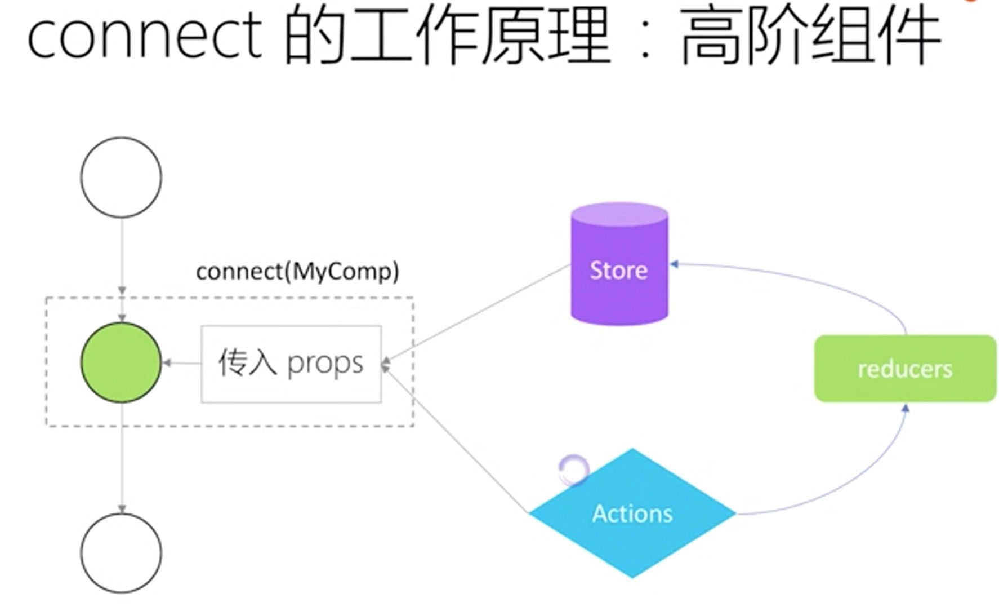

## React & Redux 进阶

### 1. React的思想 

+ 虚拟 DOM 

+ 标签就是函数，标签的属性就是函数的参数

  ```jsx
  <Parent name={this.state.name}/>
  ```
  
+ 我们自定义组件的时候必须要**大写开头**，因为只有这样 `createElement` 把组件当成一个变量而不是字符串。

  

  

  

### 2. state、props、setState

> state 和 props 之间最重要的区别是：props 由父组件传入，而 state 由组件本身管理。组件不能修改 props，但它可以修改 state。**构造函数是唯一可以给 this.state 赋值的地方**

+ 建议从组件自身的角度命名 props，而不是依赖于调用组件的上下文命名。

#### 2.1 异步的

+ 第一：出于性能考虑，React 可能会把多个 `setState()` 调用合并成一个调用,`state` 的更新可能是异步的。
+ 第二：保持内部一致性：`props` 的更新是异步的，因为`re-render`父组件的时候，传入子组件的`props`才变化；为了保持数据一致，`state`也不直接更新，都是在`flush`的时候更新
+ 要解决这个问题，可以让 `setState()` 接收一个函数而不是一个对象。这个函数用上一个`state` 作为第一个参数，将此次更新被应用时的 `props` 做为第二个参数：

```jsx
  this.setState((state, props) => ({
    counter: state.counter + props.increment
  }));
```

#### 2.2 setState 何时异步

1. 在 `react `的监听回调中是异步的（ React 中的事件监听不是用的原生的事件监听，用的是合成的自定义的事件监听）
2. 在 `react` 的生命周期钩子函数中是异步的 

#### 2.3 setState 何时同步

1. 定时器中

2. 元素的 `DOM`事件（ `ref` 获取到原生的 `dom` ）

3. `Promise` (下面的 data 是实时更新的)

   ```js
   Promise.resolve().then(data=>{
     console.log(this.state.data)
     this.setState({data})
     console.log(this.state.data)
   }
   ```

   


### 3. 受控和非受控组件
  + 用 `props` 传入数据的话，组件可以被认为是受控。<small>受控标签都接受一个 `value` 属性</small>

      + react `input` 输入框，由 react 控制表单的输入。
      + 使 react 的 `state` 成为唯一的数据源

    ```jsx
    this.setState({
    	value: event.target.value
    })
    render(){
      return (
      <input type="text" value={this.state.value} onChange={this.handleChange} />
      )
    }
    ```

    

  + 数据只保存在组件内部 `state` 上的是非受控组件（因为外部没办法直接控制 `state`)。

      + 下面 `input` 它的 `value` 只读，所以它是 React 中的一个**非受控**组件

    ```jsx
    <input type="file" />
    ```

    + 非受控组件数据交给 `Dom`来处理
      +  [使用 ref](https://zh-hans.reactjs.org/docs/refs-and-the-dom.html) 来从 DOM 节点中获取表单数据。
      + 数据都存在真实的 DOM 节点上

### 4. virtual DOM

+ 采用广度优先，层层比较的方式，算法时间复杂度 o(n)。

  

  情况一：A B 节点的属性、位置发生了变化，进行位置交换。

  情况二：节点类型发生变化会直删除节点，重新渲染新节点。

+ React 为什么要这样进行 DOM diff

  + 是基于组件的 DOM 结构是非常稳定的（一般 HTML 树是非常稳定的）
  + 是基于类型相同的兄弟节点可以被唯一标识 key

### 5. 高阶组件（HOC）

​	它是一种设计模式，不是 React 独有。

+ 普通组件 
  + 将 props 转换为 UI

  + 高阶组件（一个函数），帮助去实现一些逻辑，自身并不包含任何 UI 展现。

      +  接收一个参数（参数是一个组件），再返回一个组件。目的是将组件转换为另一个组件。

+  适应场景

   例如一个时钟的显示，封装成一个高阶组件 A 进行导出，在组件 B 中使用。B 就可以获取到高阶组件 A 的 属性 

   ```jsx
   // 高阶组件 A
   export default function A (WrapComponent){
     return class extends Component {
       state = {time:new Date()}
     }
   	render(){
       return (
       	<WrapComponent time={this.state.time} ...this.props />
       )
     }
   }
   // 组件 B
   import A from 'xxx'
   class B extends Component {
     render(){
       return (
       	<div>{this.props.time}</div>
       )
     }
   }
   export default A(B) // 这样就可以获得 A 组件的属性 
   ```

   上面可以看到，并没有复用 A 组件。

### 6. createContext API 及使用场景

出现的意义是为了解决组件间通信的问题，因为组件间数据的层层传递非常麻烦。Redux 就依赖此API。来共享全局状态。

​	

使用场景：主题、语言切换等。

```jsx
// Context 可以让我们无须明确地传遍每一个组件，就能将值深入传递进组件树。
// 为当前的 theme 创建一个 context（“light”为默认值）。
const ThemeContext = React.createContext('light'); 

class App extends React.Component {
  render() {
    // 使用一个 Provider 来将当前的 theme 传递给以下的组件树。
    // 无论多深，任何组件都能读取这个值。
    // 在这个例子中，我们将 “dark” 作为当前的值传递下去。
    return (
      <ThemeContext.Provider value="dark">
        <Toolbar />
      </ThemeContext.Provider>
    );
  }
}

// 中间的组件再也不必指明往下传递 theme 了。
function Toolbar(props) {
  return (
    <div>
      <ThemedButton />
    </div>
  );
}

class ThemedButton extends React.Component {
  render(){
    return (
    	<ThemeContext.Consumer>
       {/* 以函数作为子组件，放到 Consumer 里面才会生效 */}
      	{
          theme => <Button theme={theme} {...props}/>
        }
      </ThemeContext.Consumer>
    )
  }
}
```

如果增加一些功能，点击切换主题，道理是一样的，切换的时候传给 Context 的 provider 传入主题的值让其层层传递就可以。这样就做到了实时更新数据。

**为什么不采用写一个外部配置文件的方式进行主题更改？**

如果写成一个配置文件去切换，那么你还需要监听数据的变化然后再进行更新（forceUpdate）的操作。因为外部的数据并不属于组件内部的一个状态。

### 7. Redux

> 应⽤中所有的 `state` 都以⼀个对象树的形式储存在⼀个单⼀的 `store` 中。惟⼀改变 `state` 的办法是触发 `action `⼀个描述发⽣了什么的对象。
>
> 为了描述 `action` 如何改变 `state` 树，你需要编写 `reducers。`

+ React 的模式是 state 到 DOM，是组件内部的状态。

+ Redux 的模式是把状态移动到了组件之外，全局的状态，放到一个唯一的 store 树上。
+ Redux 的特性是纯函数更新 store，reducer 根据传入的 state 和 action 生成新的 state 。

#### 7.1 createStore()

1. 接收的参数为 `reducer` 函数，返回 `store`。这样就产生了一个 store 。
  + `store` 的方法
    + `getState()` 返回值为 `store` 内部保存的数据
    + `dispatch()` 参数为 `action` 对象，触发 `reducer`，更新 `store` 触发 `subscribe` 监听，更新视图
    + `subscribe()` 参数为监听内部 `state` 更新的回调函数 

#### 7.3 action

##### 7.3.1 bindActionCreators(actionCreators, dispatch)

1. `actionCreators` (*Function* or *Object*): 一个 [action creator](https://www.redux.org.cn/docs/Glossary.html#action-creator)，或者一个 value 是 action creator 的对象。
2. `dispatch` (*Function*): 一个由 [`Store`](https://www.redux.org.cn/docs/api/Store.html) 实例提供的 [`dispatch`](https://www.redux.org.cn/docs/api/Store.html#dispatch) 函数。

```jsx
// action 
function plus(){
  return { type:'PLUS',payload:{count:1} }
}
// 用store 分发一个 action 
store.dispatch(plus())
```

用 bindActionCreators 进行改写

```JS
// action 
function plus(){
  return { type:'PLUS',payload:{count:1} }
}
function minus(){
  return { type:'MINUS',payload:{count:1} }
}

const action = bindActionCreators({plus,minus},store.dispatch) 

// 内部会执行 dispatch
action.plus()
action.minus()
```

##### 7.3.2 异步 action 流程


流程说明：

在 View 进行 click 触发一个**异步 action** 然后被中间件（redux-thunk）截获，处理完成后，进行dispatch 到reducer 然后到到 state 进行处理，更新 State 触发 View 更新。

*中间件是一些函数用于定制对特定请求的处理过程*

```js
function middleWare({dispatch,getState}){
  return function(next){
      return function(action){
         //do...
        return next(action)//处理完后调用下一个中间件
    }
  }
}

// es6写法
({dispatch,getState})=>next=>action=>next(action)


// store
import {createStore,applyMiddleware} from 'redux'
import ReduxThunk from 'redux-thunk'
export default createStore(appReducer,(applyMiddleware(ReduxThunk)))
```

*`redux-thunk` 截获异步请求的依据就是判断这个  `action` 是不是一个函数 （`Promise`）是的话就执行这个函数，执行后再 `diapatch` 这个 `action`*


#### 7.4 reducer 

reducer 是不允许有副作用的。你不能在里面操作 DOM，也不能发 Ajax 请求，更不能直接修改 state，它要做的仅仅是 —— 初始化和计算新的 state. 就是根据老的 state 和传入的 action 生成一个新的 state，会有好多个 reducer 函数

```js
export function loginUserInfo (previousState = {}, action) {
  if (action.type === GET_LOGIN_USER_INFO || action.type === LOGIN) {
    return action.data.userInfo || {}
  } else if (action.type === LOGOUT) {
    return {}
  } else {
    return previousState
  }
}
```

#### 7.4.1  combineReducers()

+ 接收包含`n`个 `reducer` 的对象，返回一个新的 `reducer` 函数

### 8. react-redux

#### 8.1 connect()

connect() 是一个高阶函数,执行后返回一个高阶组件，接收一个UI组件，返回一个容器组件。

从左到右看。




参数为：

+ `mapStateToProps:`一个函数，指定向UI组件传递哪些一般属性，必须返回一个对象
+ `mapDispatchToProps:`可以是对象，对象所定义的方法名将作为属性名；每个方法将返回一个新的函数；也可以是函数通过`dispatch`显式分发`action`,目的是向UI组件传递函数

#### 8.2 Provider

`Provider` 组件，接收 `store` 属性让所有组件都看到 `store`，通过 `store` 读取、更新状态。

```jsx
export default App extends Component {
  render(){
    return (
    	<Provider store = { store } >
      
      </Provider>
    )
  }
}
```

### 9. 如何组织 redux 

+ 单个 `action` 和 `reducer` 放在同一个文件，利于改写不用来回切换文件。
+  统一在 `action.js` 和 `reducer.js` 导入所有的 `action` 和 `reducer`

#### 9.1 actionType、action 方法和 reducer 方法的命名

1. `actionType `常量采用下划线命名法
2. `action、reducer` 采用驼峰命名法，适当可使用下划线
3. `actionType `名称与 `action`的名称，结构都动宾结构：`‘V+N’`
4. `reducer`方法的命名为`action`名去掉动词部分的宾语（名词）部分

以获取登录用户信息为例子：

```jsx
// actionType常量
GET_LOGIN_USER_INFO = 'GET_LOGIN_USER_INFO'

// action方法
export function getLoginUserInfo () {
  ...
}

//reducer
export function loginUserInfo (previousState = {}, action) {
  if (action.type === GET_LOGIN_USER_INFO || action.type === LOGIN) {
    return action.data.userInfo || {}
  } else if (action.type === LOGOUT) {
    return {}
  } else {
    return previousState
  }
}
```

### 10.不可变数据

#### 10.1 redux 运行的基础


如上图：我们更新左边图的一个点，无论你怎么更新都需要复制一份（深、浅拷贝）包含修改的部分，右图绘制**绿色的点**需要更新的点，其它没有改变的点无需更新。没有改变的点就是不可变数据。

#### 10.2 redux 需要不可变数据的原因

+ 性能优化
  + reducer 根据传入的 state 和 action 生成了一个新的 state 而不是修改原有的 state 
  + 这个时候就可以比较新旧 state 不需要比较值，不需要进行深层次的遍历，比较引用就可以。从而确定是否需要更新组件。
+ 易于调试跟踪
  + 可以追踪到新旧 state 
+ 易于推测
  + 推测 action 的状态 ，是否正确。

#### 10.3 操作不可变数据

+ 原生的两种方法，`Object.assign()` ,` {...} `。

+ `Immutability-helper` （节点很深可以用这个，用法类似 `Object.assign()`）

+ `Immer`

  Immer 的用法，性能没有原生的`Object.assign()`好。

  ```js
  import produce from 'immer'
  
  // 接收旧的 state ，回调函数里可以直观的进行修改，类似在原有的 state 上进行修改，采用代理的方式。
  produce(state,drafState=>{
    drafState.todos.push('xxx')
  })
  ```

### 11. react-router-dom 

#### 11.1 为什么需要路由

+ 单页应用需要来回切换
+ 通过 `URL` 可以定位到页面
+ 可以清晰（语义化）的划分资源

#### 11.2 实现方式

1. URL 模式

   1. 通过 `BrowserRouter` 实现，HTML5 history API 。

   ```jsx
    <BrowserRouter>
     <Switch>{/* 该组件只渲染第一个与当前访问地址匹配的  <Route>  或  <Redirect> */}
       <Route exact path={'/login'}  component={Login}></Route>
       <Route path={'/'} component={Admin}></Route>
     </Switch>
    </BrowserRouter>
   ```

2. hash 模式

   1. 通过 `HashRouter` 实现
   2. 支持低版本浏览器。使用 window.location.hash 来保持 UI 和 url 的同步。

3. 内存模式

   1. 通过 `MemoryRouter` 实现。
   2. 服务端渲染的时候用，存在内存中，URL 地址无变化 。

#### 11.3 参数定义、路由嵌套

+ 通过 URL 传递参数

  + 应用场景：一般需要复制链接到别处仍可以看到当前组件内部的数据。不需要根据 URL 传递到组件，组件再请求数据，复制 URL 后直接就去请求了。

  ```jsx
  <Link to = {'/user/123'}> render user123 </Link>
  
  <Router path = {'/user:id'} .../>
  ```

+ 如何获取参数

  ```jsx
  {/* 获取上面的 id */}
  this.props.match.params.id 
  ```

### 12. 单元测试

#### 12.1 Jest

Facebook 开源的 JS 单元测试框架

...

### 13. 理想的架构

1. 易于开发
   + 开发工具是否完善
   + 生态圈、社区是否活跃繁荣
2. 易于维护
   + 代码是否容易上手
   + 文档是否齐全

4. 易于构建
   + 构建工具的选择
5. 易于测试
   + 功能分层是否清晰
   + 副作用少，尽量使用纯函数
6. 易于扩展

### 14. 性能问题

#### 14.1 常见的性能问题场景

+ 键盘输入
  + 出现卡顿，采用事件节流。
+ 鼠标移动
  + 滚动卡顿，采用防抖。

#### 14.2 代码的性能

+ 组件拆分

  根据 `React` 的虚拟 DOM DIFF 算法 `O(n)`。组件根据情况拆分的越细，`React` 性能越高。因为组件细了后就可以作为一个纯组件对待，可以整体看成是一个 `dom` ，组件状态未发生改变的时候，就不会更新这个 `dom` 节点，对应的也就不会进行 Dom diff 的操作。

+ 网络优化，按需加载

  + 借助 webpack  `import` 进行动态加载。

  + 使用 react-loadable库。

    ```jsx
    /**
     * @desc 借助 react-loadable 进行 code-splitting 时的loading组件
     */
     function Loading({ error }) {
      if (error) {
        return 'error';
      } else {
        return <div></div>;
      }
    }
    
    /**
     * @desc 引入，注意是import()方法，不是import关键字
     */
    import Loadable from 'react-loadable'
    const Home = Loadable({
      loader: () => import('./children/Home'),  
      loading: Loading,
    })
    
    
    /**
     * @desc 路由匹配成功的时候才引入，而不是一开始全部引入 
     */
    <Route path="/home" exact component={Home} /> 
    ```

  +  React 的 `Suspense`  api

  ```jsx
  import { BrowserRouter as Router, Route, Switch } from 'react-router-dom';
  import React, { Suspense, lazy } from 'react';
  
  const Home = lazy(() => import('./routes/Home'));
  const About = lazy(() => import('./routes/About'));
  
  const App = () => (
    <Router>
      <Suspense fallback={<div>Loading...</div>}>
        <Switch>
          <Route exact path="/" component={Home}/>
          <Route path="/about" component={About}/>
        </Switch>
      </Suspense>
    </Router>
  );
  ```

  

#### 14.3 注意可重构代码

+ 什么的代码可重构？
  + 功能独立，不依赖（较少依赖）外部变量。
  + 也被其它组件依赖

#### 14.4 利用工具进行定位问题

+ React dev-tool

#### 组件通信

  + 父传子

    + 将父组件的方法以函数的形式传递给子组件，在子组件中调用

  + 子传父 

    + 父组件中通过 ref 得到子组件的标签对象
    + 通过 this.myRef.current.xxx() 得到子组件的方法

    ```jsx
    // 父组件
    class Parent extends React.Component {
      constructor(props) {
        super(props);
        this.myRef = React.createRef();
      }
      test(){
        const childMethodResult = this.myRef.current.xxx() // 'child methods'
      }
      render() {
        return <Children ref={this.myRef} />;
      }
    }
    // 子组件
    class Child extends React.Component {
      constructor(props) {
        super(props);
      }
      xxx(){
        return 'child methods'
      }
      render() {
        return null;
      }
    }
    ```

    