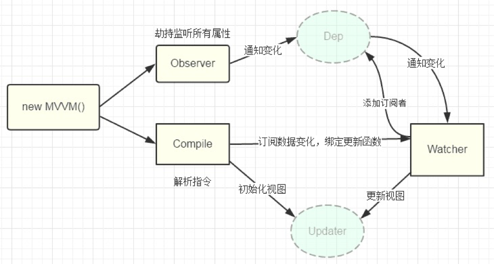

### 运行机制

> vue.js 则是采用数据劫持结合发布者-订阅者模式的方式，通过`Object.defineProperty()`来劫持各个属性的`setter`，`getter`，在数据变动时发布消息给订阅者，触发相应的监听回调.


​	`MVVM` 作为入口，整合了 `observer` 、 `compile` 、 `watcher` 。通过 `observer` 来监视 `model` 的变化，通过 `compile` 来编译指令模板。利用 `watcher` 来搭建 `observer` 、`compile`、之间的桥梁。

​	这样就达到了：数据变化 → 视图更新。视图更新 → 数据变化 → 视图更新。





#### 实例化 Vue 

```javascript
class Vue {
  constructor(options) {
    this.$el = options.el
    this.$data = options.data
    this.$options = options
    if (this.$el) {
      // 1.数据劫持 observe
      new Observer(this.$data)
      // 2.指令解析 compile
      new Compile(this.$el, this)
      // 3. 代理一下 this.$data.obj === this.obj
      this.proxyData(this.$data)
    }
  }
  proxyData(data){
    for(const key in data){
      Object.defineProperty(this,key,{
        get(){
          return data[key]
        },
        set(value){
          data[key] = value
        }
      })
    }
  }
}
```


+ 数据劫持（`observer`）

  + 遍历所有的对象

    ```javascript
    observe(data) {
        if (data && typeof data === 'object') {
          Object.keys(data).forEach(key => {
            // 递归对象
            this.observe(data[key])
            const dep = new Dep()
            Object.defineProperty(data, key, {
              configurable: true,
              enumerable: true,
              get() {
                // 数据劫持 和 Dep 关联起来
                Dep.target &&  dep.addSub(Dep.target)
                return value
              },
              set: (newValue) => {
                // 数据劫持
                this.observe(newValue) // 让修改后的值有 get set 方法
                if (newValue !== value) {
                  // 调用监视者 去更新视图
                  value = newValue
    
                }
                 // 通知 Dep 让 Dep 在通知 watcher 
                 dep.notify()
              }
            })
          })
        }
      }
    ```

    

+ 数据编译（`compile`）

  + 遍历所有节点放入 `fragment`

    ```javascript
    compile(fragment) {
        const childNodes = fragment.childNodes;
        [...childNodes].forEach(child => {
          // 判断每个节点的类型，是元素还是文本，分别进行处理
          if (this.isNodeElement(child)) {
            // console.log('元素',child)
            this.compileElement(child)
          } else {
            // console.log('文本', child)
            this.compileText(child)
          }
          // 递归
          if (child.childNodes) {
            this.compile(child)
          }
        })
      }
    ```

#### Dep

关联 Observer 和 Watcher

```javascript

// 1. 通知 observe(观察者)) 数据变化
// 2. 添加订阅（搜集 watcher）
class Dep {
  constructor() {
    this.subs = []
  }
  addSub(watcher) {
    this.subs.push(watcher)
  }
  notify() {
    // 遍历观察者
    console.log('所有的观察者',this.subs)
    this.subs.forEach(watcher => {
      // 在这里调用需要更新的观察者
      watcher.update()
    })
  }
}

```

#### Watcher

```javascript
// 观察者
// 比较新值和旧值
class Watcher { // 什么时候绑定？ 在解析、更新数据的时候
  constructor(expr, vm, cb) {
    this.expr = expr
    this.vm = vm
    this.cb = cb
    this.oldValue = this.getOldValue()
  }
  update() {
    // 如何得到
    // 调用 watcher 的 update 方法后得到的就是新值
    const newValue = compilUtil.getVal(this.expr, this.vm)
    if (newValue !== this.oldValue) {
        this.cb(newValue)
    }
  }
  getOldValue() {
    // 如何得到？
    // compilUtil.getVal()

    Dep.target = this //这里定义当前数据的 watcher
    const oldValue = compilUtil.getVal(this.expr, this.vm)
    Dep.target = null  // 得到数据就销毁
    return oldValue
  }
}
```


  observe - dep - watcher - view